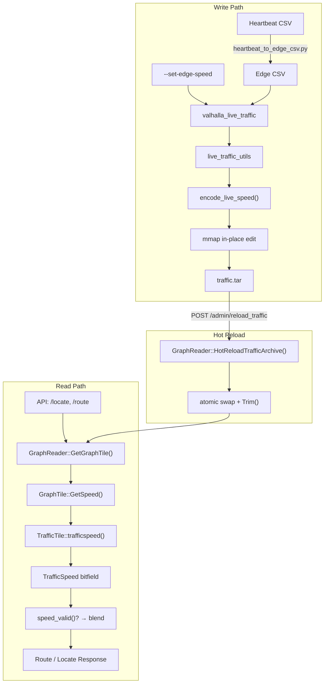
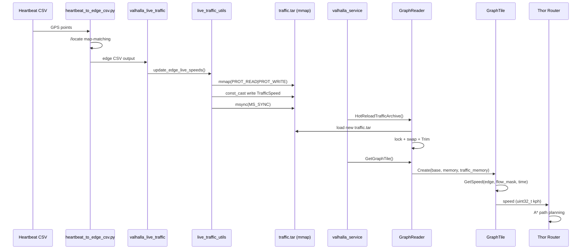

## Intro

Valhalla is an open source routing engine, with support for time-dependent routing and traffic. 

It doesn't have at the moment any official step-by-step instructions on how to add traffic support, only a description of the feature: https://valhalla.readthedocs.io/thor/simple_traffic/

This repository shows how to create an instance of Valhalla with both types of supported traffic information:
1. __Predicted traffic__, used for time-based routing (e.g. _find a route between A and B that leaves tomorrow at 12:00_). This is done through a CSV which contains encoded speeds for a whole week for a given Valhalla graph edge.
2. __Live traffic__, used for real-time decisions, and which can be set dynamically. This is done through a `traffic.tar` file that is memory mapped by Valhalla.  

The files needed for the two types of traffic are generated using a new tool `valhalla_traffic_demo_utils`.
This has similar interface to existing Valhalla tools and makes use of data structures and algorithms in the Valhalla source code.

---

# Real-time Speed Support

本项目扩展了 Valhalla 的 live traffic 能力，支持**逐边 (per-edge) 实时速度注入**和**运行时热加载 (Hot Reload)**。

### 核心能力

| 能力 | 说明 |
|------|------|
| 单边注入 | CLI 直接指定一条边的速度，适合调试 |
| 批量注入 | 从 CSV 文件批量注入，适合产线数据管道 |
| 从零构建 | 无需预先存在的 traffic.tar，直接从数据创建 |
| Hot Reload | 写入后立即生效，无需重启 valhalla_service |
| 速度编码 | 自动将 km/h 转换为 TrafficSpeed 位字段（2 kph 分辨率） |

### 数据流

```
Heartbeat GPS CSV → heartbeat_to_edge_csv.py → edge CSV → valhalla_live_traffic → traffic.tar → valhalla_service (hot reload)
```

### 零核心侵入

所有修改仅涉及新增文件和 CLI 工具，**未修改任何 Valhalla 核心引擎文件** (`graphtile.h`, `graphreader.h`, `traffictile.h`, `dynamiccost.cc` 等)。

---

## Architecture



## Data Flow



## How It Works

```
Request Entry
      │
      ▼
┌─────────────────────────────────────────────────────┐
│ 1. Data Injection                                    │
│                                                      │
│ heartbeat CSV → edge CSV → valhalla_live_traffic     │
│   parse_edge_speeds_csv() → EdgeSpeedMap             │
│   update_edge_live_speeds() → mmap in-place edit     │
│   encode_live_speed() → TrafficSpeed bitfield        │
│   msync() → persist to traffic.tar                   │
└─────────────────────────────────────────────────────┘
      │
      ▼
┌─────────────────────────────────────────────────────┐
│ 2. Hot Reload (optional)                             │
│                                                      │
│ GraphReader::HotReloadTrafficArchive()               │
│   open new tar → parse entries → lock mutex          │
│   → swap traffic_tiles + traffic_archive             │
│   → Trim() invalidate cache                          │
└─────────────────────────────────────────────────────┘
      │
      ▼
┌─────────────────────────────────────────────────────┐
│ 3. Speed Consumption                                 │
│                                                      │
│ GraphTile::GetSpeed()                                │
│   Layer 1: Live Speed (kCurrentFlowMask)             │
│     traffic_tile.trafficspeed(idx)                   │
│     speed_valid()? → get_overall_speed()             │
│     time-decay blend with predicted/constrained      │
│   Layer 2: Predicted Speed (kPredictedFlowMask)      │
│   Layer 3: Constrained Flow (daytime 7am-7pm)        │
│   Layer 4: Free Flow (nighttime)                     │
│   Layer 5: Default OSM Speed                         │
│                                                      │
│ DynamicCost → A* / Bidirectional A* → Route Response │
└─────────────────────────────────────────────────────┘
```

## Documentation

| 文档 | 说明 |
|------|------|
| [docs/realtime_speed_pipeline.md](docs/realtime_speed_pipeline.md) | 完整技术架构文档：数据流、Tile 结构、热加载、GetSpeed 融合策略 |
| [docs/live-traffic-per-edge-injection.md](docs/live-traffic-per-edge-injection.md) | 用户手册：CLI 命令参考、CSV 格式、编码表、故障排查 |
| [docs/manual-test-procedure.md](docs/manual-test-procedure.md) | 8 阶段人工测试流程：从 Docker 容器启动到验证 |

## Usage

### 初始化 traffic.tar

```bash
valhalla_live_traffic \
  --config /valhalla_tiles/valhalla.json \
  --generate-live-traffic "2/647736/0,30,$(date +%s)"
```

### 单边注入

```bash
valhalla_live_traffic --config /valhalla_tiles/valhalla.json \
  --set-edge-speed "2/647736/0,370769,77,6"
```

### CSV 批量注入

```bash
valhalla_live_traffic --config /valhalla_tiles/valhalla.json \
  --update-edges /tmp/edge_speeds.csv
```

### 验证注入效果

```bash
curl -s http://localhost:8002/locate?verbose=true \
  -H "Content-Type: application/json" \
  -d '{"locations":[{"lat":22.3430,"lon":114.1986}],"verbose":true}' \
  | python3 -c "
import json, sys
resp = json.load(sys.stdin)
for e in resp[0].get('edges', [])[:3]:
    ei = e.get('edge_id', {})
    ls = e.get('live_speed', {})
    print(f'edge[{ei.get(\"id\",\"?\")}]: live={ls.get(\"overall_speed\",\"none\")} kph')
"
```

### Hot Reload (不重启服务)

```bash
# 修改速度后服务自动感知
valhalla_live_traffic --config /valhalla_tiles/valhalla.json \
  --set-edge-speed "2/647736/0,370769,5,51"

# 立即查询 — 无需重启
curl -s http://localhost:8002/locate?verbose=true \
  -H "Content-Type: application/json" \
  -d '{"locations":[{"lat":22.3430,"lon":114.1986}],"verbose":true}' \
  | python3 -c "import json,sys; e=json.load(sys.stdin)[0]['edges'][0]; print(e.get('live_speed',{}).get('overall_speed','none'), 'kph')"
```

---

## How to run

1. Build the docker image `docker build -t valhalla-traffic .` 
   * (takes around 10 min, as it compiles valhalla and its dependency prime server + downloads and processes the OSM map for Andorra)
2. Start container `docker run -p 8002:8002 -it valhalla-traffic bash`
    * The port forwarding is important for the demos below
3. Inside the container, start the server ```LD_LIBRARY_PATH=/usr/local/lib valhalla_service /valhalla_tiles/valhalla.json 1```
4. Verify that Valhalla processed the traffic information correctly, by querying the Valhalla graph edge which we updated (or using the interactive demo in the next step):
```
curl http://localhost:8002/locate --data '{"locations": [{"lat": 42.506709, "lon": 1.523623}], "verbose": true}' | jq
```
One of the ways returned by the query should contain a non-empty `predicted_speeds` array for predicted traffic, and a non-empty `live_speed` object for live traffic. This means that Valhalla has the traffic information available.

Example:
```
[
   {
    "input_lon": 1.523623,
    "input_lat": 42.50671,
    ...
    "edges":[
         {
            "predicted_speeds":[6, 6, 6, 6, 6, 6, ... ],
            "edge_info":{
               "way_id":173167308,
               ...
            },
            "live_speed": {
              "congestion_2": 0.03,
              "breakpoint_1": 1,
              "congestion_1": 0.02,
              "speed_1": 40,
              "congestion_0": 0,
              "speed_2": 40,
              "breakpoint_0": 1,
              "speed_0": 40,
              "overall_speed": 40
            }      
      ...
```
5. Check the  interactive demo (uses the locally running instance of Valhalla): https://valhalla.github.io/demos/routing/index-internal.html#loc=15,42.510609,1.534503
   * __Left click__ to place origin / destination for routing
   * __Right click__ to query node/edge info
6. Do a live update of the traffic speeds and check how it is picked up automatically:
   * For some reason, the tar file has to be customized before starting the service in order for the changes to be picked up automatically. Probably has something to do with how the memory mapping works.
   * Do a dummy customization with live speed 0, so basically unsetting live speeds:
     ```
     valhalla_traffic_demo_utils --config /valhalla_tiles/valhalla.json --update-live-traffic 0
     ```
   * Restart the service:
      ```
      LD_LIBRARY_PATH=/usr/local/lib valhalla_service /valhalla_tiles/valhalla.json 1
      ```
   * Confirm that live speeds are not available 
      ```
     curl http://localhost:8002/locate --data '{"locations": [{"lat": 42.506709, "lon": 1.523623}], "verbose": true}' | jq | grep overall_speed
     ```
   * Customize with new values
     ```
     valhalla_traffic_demo_utils --config /valhalla_tiles/valhalla.json --update-live-traffic 30
     ```
   * Check the live speeds again, should be available now
      ```
     curl http://localhost:8002/locate --data '{"locations": [{"lat": 42.506709, "lon": 1.523623}], "verbose": true}' | jq | grep overall_speed
     ```

## Predicted traffic Demo

The predicted traffic for the following OSM way is slowed as part of the Dockerfile commands: https://www.openstreetmap.org/way/173167308#map=17/42.50676/1.52457


As live traffic has priority over predicted traffic, make sure all live traffic speeds are set to 0, so they are ignored:
```
valhalla_traffic_demo_utils --config /valhalla_tiles/valhalla.json --update-live-traffic 0
```

When requested simple, non-time-dependent routing, Valhalla uses the way:


When requested time-dependent routing (Can be set in routing options in the demo), Valhalla avoids the way:


## Other gotchas

### Predicted traffic
For predicted traffic, speeds must be higher than 5 Km/h to be taken into account. 
Anything lower than that is considered noise.

The free flow and constrained flow speeds are used by default by the routing API.
In order to use the predicted traffic information, the `date_time` parameter needs to be set in the route request.  

### Live traffic
Check the `GetSpeed` function in `baldr/graphtile.h` for validation of live traffic data.

## Other types of requests:

### Route (supports traffic):
```
curl http://localhost:8002/route --data '{"locations":[{"lat":42.505884,"lon":1.520732},{"lat":42.50885,"lon":1.528551}],"costing":"auto","directions_options":{"units":"meters"}}' | jq
```
Decode polyline6: http://valhalla.github.io/demos/polyline/

### DistanceMatrix (Doesn't support traffic):
```
curl http://localhost:8002/sources_to_targets --data '{"sources":[{"lat":42.505884,"lon":1.520732},{"lat":42.50885,"lon":1.528551},{"lat":42.508282,"lon":1.521729}], "targets":[{"lat":42.506076,"lon":1.517199},{"lat":42.509775,"lon":1.525169},{"lat":42.501021,"lon":1.51791}],"costing":"auto","directions_options":{"units":"kilometers"},"date_time":{"type":1,"value":"2021-08-30T23:50"}}' | jq
```

### Isochrone (supports traffic):
```
curl http://localhost:8002/isochrone --data '{"locations":[{"lat": 42.506709, "lon": 1.523623}],"costing":"auto","contours":[{"time":5,"color":"ff0000"}],"date_time":{"type":1,"value":"2021-09-30T23:50"}}' | jq
```
View isochrone: http://geojson.io/

### Locate
Used to match a single point to the nearest road: (click on the map, get a green point -> click on the green point to get info)
http://valhalla.github.io/demos/locate/

Or cmd line:

```
curl http://localhost:8002/locate --data '{"locations":[{"lat":42.505884,"lon":1.520732},{"lat":42.508282,"lon":1.521729}]}' | jq
```

### Map match

```
curl http://localhost:8002/trace_route --data '{"shape":[{"lat":42.505884,"lon":1.520732,"type":"break"},{"lat":42.508282,"lon":1.521729,"type":"break"}],"costing":"auto","shape_match":"map_snap"}' | jq

curl http://localhost:8002/trace_attributes --data '{"shape":[{"lat":42.505884,"lon":1.520732,"type":"break"},{"lat":42.508282,"lon":1.521729,"type":"break"}],"costing":"auto","shape_match":"map_snap"}' | jq
```

## Possible workflow for generating traffic based on lat/lng input data
Let's assume that the traffic information has to be generated based on some input data in the form of a list of raw acquired speeds for a given lat/lng point.

In order to get the valhalla way id of an array of lat/lng pairs, the following request can be used:
```
curl http://localhost:8002/trace_attributes --data '{"shape":[{"lat":<lat>,"lon":<lng>},{"lat":<lat>,"lon":<lng>}, ... ],"costing":"auto","shape_match":"map_snap","filters":{"attributes":["edge.names","edge.id", "edge.weighted_grade","edge.speed", "edge.way_id", "edge.length", "edge.traversability", "edge.density", "matched.distance_along_edge", "matched.edge_index", "matched.distance_from_trace_point"],"action":"include"}}' | jq
```

This will return for each point in the "shape" array an edge index, which can be used to get the way id from the same response.

After having the way id for each point, just follow the Dockerfile steps, ignoring the usage of the `way_edges.txt` mapping.  

## Fixed Valhalla commit
`valhalla_traffic_demo_utils.cc` needs to be compiled as part of the main `cmake` + `make` calls.

Due to this, I have added two custom CmakeLists, which change from time to time in the upstream repository. 
Because the Valhalla repository is updated frequently, in order to remove the risk of future the breaking changes, a fixed commit is used to build Valhalla.

The two required changed CmakeLists are as follows:
* The CMakeLists under `src/` should add the microtar library, which is used by `valhalla_traffic_demo_utils`:
  ```
  target_include_directories(valhalla
  PUBLIC
  ${VALHALLA_SOURCE_DIR}
  ...
  ${VALHALLA_SOURCE_DIR}/third_party/microtar/src
  ```
  and
  ```
  add_library(valhalla ${valhalla_src} ${VALHALLA_SOURCE_DIR}/third_party/microtar/src/microtar.h
  ${VALHALLA_SOURCE_DIR}/third_party/microtar/src/microtar.c)
  ```
* The CmakeLists in the root of the project should also contain `valhalla_traffic_demo_utils` as part of the `valhalla_data_tools`, for example:
  ```
  set(valhalla_data_tools valhalla_build_statistics valhalla_ways_to_edges valhalla_validate_transit
  valhalla_benchmark_admins valhalla_build_connectivity	valhalla_build_tiles valhalla_build_admins
  valhalla_convert_transit valhalla_fetch_transit valhalla_query_transit valhalla_add_predicted_traffic
  valhalla_assign_speeds valhalla_traffic_demo_utils)
  ```
