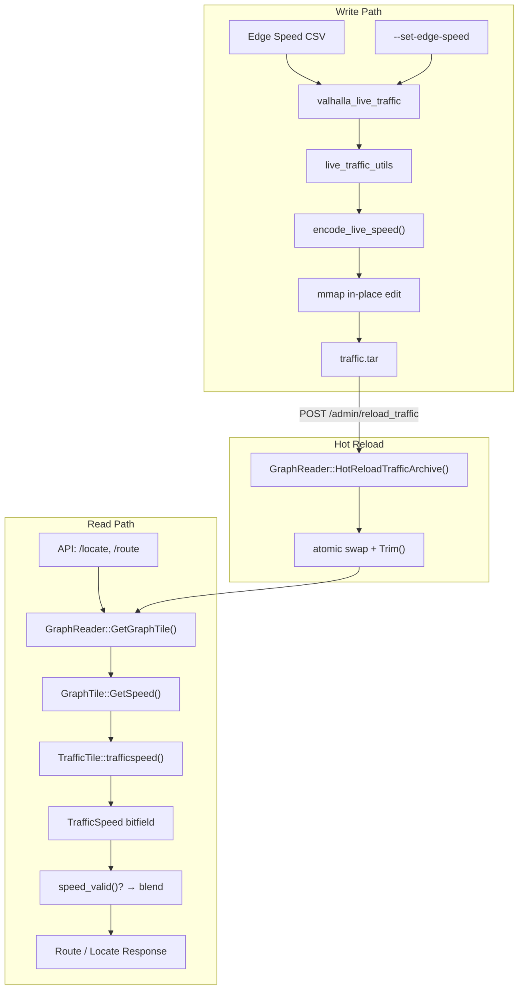
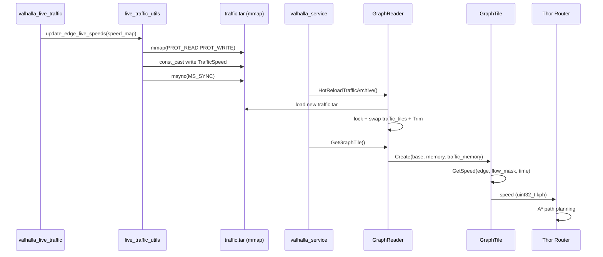

# Valhalla Live Traffic — Per-Edge Real-time Speed Injection

基于 Valhalla 路由引擎的**逐边实时速度注入**与**热加载 (Hot Reload)** 方案。

支持在不重启 `valhalla_service` 的情况下，通过 CLI 工具向 `traffic.tar` 注入单条或多条边的实时速度，路由决策即时生效。

---

## 核心能力

| 能力 | 说明 |
|------|------|
| **单边注入** | `--set-edge-speed` 直接指定一条边的速度，适合调试和精确控制 |
| **批量注入** | `--update-edges` 从 CSV 文件批量注入，适合产线数据管道 |
| **从零构建** | `build_live_traffic_from_edges()` 无需预先存在的 traffic.tar |
| **Hot Reload** | 写入 traffic.tar 后 valhalla_service 自动感知，无需重启 |
| **速度编码** | 自动将 km/h 转换为 TrafficSpeed 64-bit 位字段（2 kph 分辨率） |
| **零核心侵入** | 未修改任何 Valhalla 核心引擎文件 (`graphtile.h`, `graphreader.h`, `traffictile.h`, `dynamiccost.cc`) |

---

## Architecture



## Data Flow



## How It Works

```
                       ┌──────────────────────────┐
                       │  1. Data Injection        │
                       │                            │
                       │  Edge Speed CSV            │
                       │  → parse_edge_speeds_csv() │
                       │  → EdgeSpeedMap            │
                       │  → update_edge_live_speeds │
                       │  → mmap in-place edit       │
                       │  → encode_live_speed()      │
                       │  → msync() persist          │
                       └────────────┬───────────────┘
                                    │
                                    ▼
                       ┌──────────────────────────┐
                       │  2. Hot Reload            │
                       │                            │
                       │  HotReloadTrafficArchive() │
                       │  → open new tar            │
                       │  → lock(tile_extract_mutex)│
                       │  → swap traffic_tiles      │
                       │  → Trim() invalidate cache │
                       └────────────┬───────────────┘
                                    │
                                    ▼
                       ┌──────────────────────────┐
                       │  3. Speed Consumption     │
                       │                            │
                       │  GraphTile::GetSpeed()     │
                       │  Layer 1: Live Speed       │
                       │    traffic_tile            │
                       │    .trafficspeed(idx)       │
                       │    .speed_valid()?          │
                       │  Layer 2: Predicted Speed   │
                       │  Layer 3: Constrained Flow  │
                       │  Layer 4: Free Flow         │
                       │  Layer 5: OSM Default       │
                       │                            │
                       │  DynamicCost → A* → Route   │
                       └────────────────────────────┘
```

---

## 配置要求

`valhalla.json` 的 `mjolnir` 段必须包含 `traffic_extract`：

```json
{
  "mjolnir": {
    "tile_dir": "/valhalla_tiles",
    "traffic_extract": "/valhalla_tiles/traffic.tar"
  }
}
```

---

## Usage

### 构建

```bash
cd poc
./build.sh                # 编译 prime_server + valhalla + 生成 tiles + traffic
```

Docker 构建：

```bash
docker build -t valhalla-live-traffic:v1 .
docker run -d --name valhalla-live -p 8002:8002 valhalla-live-traffic:v1 sleep infinity
docker exec -it valhalla-live bash
```

### 启动服务

```bash
LD_LIBRARY_PATH=/usr/local/lib valhalla_service /valhalla_tiles/valhalla.json 1
```

### 初始化 traffic.tar

```bash
valhalla_live_traffic \
  --config /valhalla_tiles/valhalla.json \
  --generate-live-traffic "2/647736/0,30,$(date +%s)"
```

### 单边注入

```bash
# 注入 edge 370769 速度为 77 km/h，畅通
valhalla_live_traffic --config /valhalla_tiles/valhalla.json \
  --set-edge-speed "2/647736/0,370769,77,6"

# 注入 edge 370770 速度为 5 km/h，严重拥堵
valhalla_live_traffic --config /valhalla_tiles/valhalla.json \
  --set-edge-speed "2/647736/0,370770,5,51"
```

### CSV 批量注入

```bash
valhalla_live_traffic --config /valhalla_tiles/valhalla.json \
  --update-edges /tmp/edge_speeds.csv
```

CSV 格式：

```csv
# tile_id, edge_index, speed_kph, congestion
2/647736/0,370769,77.0,6
2/647736/0,370770,55.0,16
```

- 以 `#` 开头的行视为注释
- 第 4 列 congestion 可选（默认 1）

### 验证注入效果

```bash
curl -s http://localhost:8002/locate?verbose=true \
  -H "Content-Type: application/json" \
  -d '{"locations":[{"lat":22.3430,"lon":114.1986}],"verbose":true}' \
  | python3 -c "
import json, sys
resp = json.load(sys.stdin)
for e in resp[0].get('edges', [])[:3]:
    ei = e.get('edge_id', {})
    ls = e.get('live_speed', {})
    print(f'edge[{ei.get(\"id\",\"?\")}]: live={ls.get(\"overall_speed\",\"none\")} kph')
"
```

预期输出：注入过的边显示 `live=... kph`，未注入边显示 `live=none kph`。

### Hot Reload

修改 traffic.tar 后服务自动感知，**无需重启**：

```bash
# 修改速度
valhalla_live_traffic --config /valhalla_tiles/valhalla.json \
  --set-edge-speed "2/647736/0,370769,5,51"

# 立即查询 — 速度已变化
curl -s http://localhost:8002/locate?verbose=true \
  -H "Content-Type: application/json" \
  -d '{"locations":[{"lat":22.3430,"lon":114.1986}],"verbose":true}' \
  | python3 -c "import json,sys; e=json.load(sys.stdin)[0]['edges'][0]; print(e.get('live_speed',{}).get('overall_speed','none'), 'kph')"
```

### Route 查询

```bash
curl -s "http://localhost:8002/route" \
  -H "Content-Type: application/json" \
  -d '{
    "locations": [
      {"lat": 22.280, "lon": 114.160},
      {"lat": 22.320, "lon": 114.190}
    ],
    "costing": "auto",
    "directions_options": {"units": "km"}
  }' | python3 -c "
import json, sys
s = json.load(sys.stdin)['trip']['summary']
print(f'time={s[\"time\"]}s, length={s[\"length\"]}km')
"
```

---

## CLI 命令参考

| 命令 | 说明 |
|------|------|
| `--generate-live-traffic` | 为指定 tile 创建 baseline traffic.tar |
| `--update-edges <csv>` | 从 CSV 文件批量注入速度 |
| `--set-edge-speed <spec>` | 单边注入（可多次指定） |
| `--update-live-traffic <kph>` | 全局覆盖所有 tile 所有边为同一速度 |
| `--get-tile-id <raw_id>` | 将 raw GraphId 转为 `level/tile/id` 格式 |
| `--get-traffic-dir <raw_id>` | 获取对应 edge 的 traffic 目录路径 |
| `--generate-predicted-traffic` | 生成 predicted traffic 的 base64 编码 (调试) |

---

## 速度编码

TrafficSpeed 是一个 64-bit 位字段：

```
┌─7bit──┬─7bit──┬─7bit──┬─7bit──┬─8bit──┬─8bit──┬─6bit──┬─6bit──┬─6bit──┬1bit─┬1bit─┐
│overall│speed1 │speed2 │speed3 │break1 │break2 │cong1  │cong2  │cong3  │incid│spare│
└───────┴───────┴───────┴───────┴───────┴───────┴───────┴───────┴───────┴─────┴─────┘
```

- 速度编码: `floor(speed_kph / 2)`, 分辨率 2 kph, 最大 252 km/h
- `breakpoint1=255` 表示速度覆盖整条边
- `speed_valid()`: `breakpoint1 != 0 && overall != 127`

**编码对照**:

| km/h | encoded | `/locate` 返回 |
|------|---------|---------------|
| 5 | 2 | 4 |
| 30 | 15 | 30 |
| 60 | 30 | 60 |
| 77 | 38 | 76 |
| 120 | 60 | 120 |
| 252 | 126 (max) | 252 |
| ≥254 | 127 (=UNKNOWN) | `null` |

---

## 速度融合策略

`GraphTile::GetSpeed()` 按优先级融合多层速度：

| 优先级 | 层 | 条件 | 说明 |
|--------|-----|------|------|
| 1 (最高) | **Live Speed** | `flow_mask & kCurrentFlowMask` 且 `speed_valid()` | 实时速度，含时间衰减 |
| 2 | **Predicted Speed** | `has_predicted_speed()` 且时间有效 | 历史预测速度 |
| 3 | **Constrained Flow** | 日间 7am–7pm | 典型拥堵速度 |
| 4 | **Free Flow** | 夜间 | 自由流速度 |
| 5 (最低) | **Default Speed** | 始终可用 | OSM 标签派生速度 |

Live traffic 时间衰减: `multiplier = 1 - min(seconds_from_now / 3600, 1.0)` — 距当前越远，live traffic 权重越低。

---

## Documentation

| 文档 | 说明 |
|------|------|
| [docs/realtime_speed_pipeline.md](docs/realtime_speed_pipeline.md) | 完整技术架构：数据流、Tile 结构、Hot Reload、GetSpeed 融合 |
| [docs/live-traffic-per-edge-injection.md](docs/live-traffic-per-edge-injection.md) | 用户手册：CLI 命令、CSV 格式、编码表、故障排查 |
| [docs/manual-test-procedure.md](docs/manual-test-procedure.md) | 8 阶段人工测试流程 |

---

## 文件结构

```
poc/
├── valhalla_code_overwrites/
│   ├── CMakeLists.txt                          # 根 CMake, 注册 valhalla_live_traffic
│   ├── src/
│   │   ├── CMakeLists.txt                      # 子 CMake, 添加 live_traffic_utils + microtar
│   │   └── mjolnir/
│   │       ├── live_traffic_utils.h            # 库头文件
│   │       ├── live_traffic_utils.cc           # 库实现: mmap 编辑, tar 构建, 速度编码
│   │       └── valhalla_live_traffic.cc        # CLI 工具
├── valhalla/                                   # Valhalla 子模块
├── build.sh                                    # 构建脚本
├── Dockerfile                                  # Docker 构建
└── docs/
    ├── realtime_speed_pipeline.md               # 技术架构文档
    ├── live-traffic-per-edge-injection.md       # 用户手册
    └── manual-test-procedure.md                 # 测试流程
```

---

## 关键 Valhalla API

| Endpoint | 说明 |
|----------|------|
| `/route` | 路径规划 (支持 traffic 通过 `date_time` 参数) |
| `/locate` | 点匹配到最近道路，`verbose=true` 返回 `live_speed` 和 `predicted_speeds` |
| `/trace_attributes` | Map matching，返回 edge 序列 |
| `/isochrone` | 等时线 (支持 traffic) |

---

## 注意事项

### Live Traffic
- 速度 > 0 km/h 才被 Valhalla 采用（speed=0 视为道路关闭）
- `traffic.tar` 必须在服务启动前存在（`--generate-live-traffic` 创建 baseline）
- `HotReloadTrafficArchive()` 通过 mutex 保护切换，路由请求不会读到不完整数据
- 速度编码精度 2 kph，77 km/h → 76 km/h (±1.3%)

### Predicted Traffic
- 速度必须 > 5 km/h 才被采用
- 需要 `date_time` 参数启用
- Live traffic 优先级始终高于 predicted traffic
