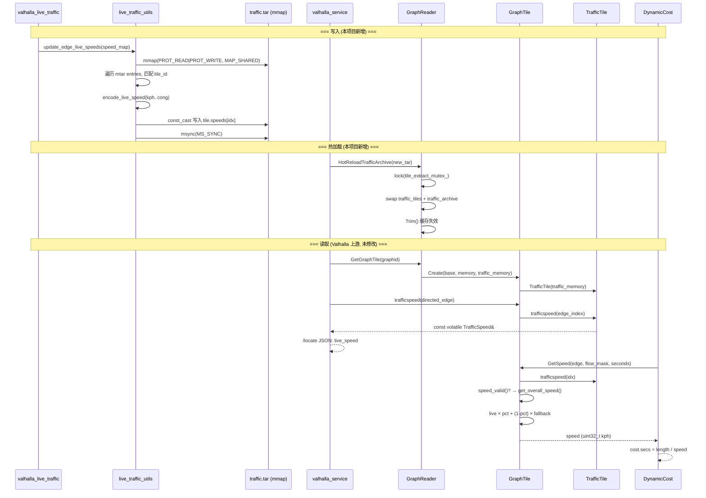

# Valhalla Live Speed — 业务功能修改文档

> **仅涵盖本项目对 Valhalla `live_speed` 相关功能的修改。不涉及 heartbeat 数据处理、predicted traffic 构建、daemon 等外围组件。**

---

## 修改范围

本项目在 Valhalla 原生 live traffic 基础上新增了**逐边 (per-edge) 实时速度注入**能力。所有修改集中在 `valhalla_code_overwrites/` 目录，**未修改任何 Valhalla 核心引擎文件**。

### 修改的文件

| 文件 | 类型 | 说明 |
|------|------|------|
| `valhalla_code_overwrites/src/mjolnir/live_traffic_utils.h` | **新建** | 库头文件：`EdgeSpeedMap` 类型别名, `encode_live_speed()`, `update_edge_live_speeds()`, `build_live_traffic_from_edges()` |
| `valhalla_code_overwrites/src/mjolnir/live_traffic_utils.cc` | **新建** | 库实现：mmap 就地编辑、tar 构建、速度编码 |
| `valhalla_code_overwrites/src/mjolnir/valhalla_live_traffic.cc` | **重命名+扩展** | CLI 工具：新增 `--update-edges`, `--set-edge-speed` |
| `valhalla_code_overwrites/CMakeLists.txt` | **修改** | 注册 `valhalla_live_traffic` 到 `valhalla_data_tools` |
| `valhalla_code_overwrites/src/CMakeLists.txt` | **修改** | 添加 `live_traffic_utils.cc` 到 `libvalhalla` + microtar |
| `graphreader.cc` (valhalla 上游) | **末尾追加** | `GraphReader::HotReloadTrafficArchive()` |

### 未修改的 Valhalla 核心文件

`graphtile.h`, `traffictile.h`, `graphreader.h`, `dynamiccost.cc`, `bidirectional_astar.h` 等 **全部未被修改**。本项目复用它们已有的 live traffic 读取路径。

---

## 数据写入路径 (Write Path)

### 整体流程

```
CLI 输入 (--set-edge-speed / --update-edges)
        │
        ▼
valhalla_live_traffic.cc (CLI 层)
  ├── parse_edge_speeds_csv()          CSV → EdgeSpeedMap
  ├── handle_set_edge_speed()          单边参数解析
  └── handle_update_edges()            批量注入调度
        │
        ▼
live_traffic_utils.cc (库层)
  ├── encode_live_speed()              km/h → TrafficSpeed 64-bit 位字段
  ├── update_edge_live_speeds()        mmap 就地编辑已有 traffic.tar
  └── build_live_traffic_from_edges()  从零创建 traffic.tar
        │
        ▼
traffic.tar (mmap'd)
```

### 核心数据结构：EdgeSpeedMap

```cpp
// live_traffic_utils.h:14-17
using EdgeSpeedMap =
    std::unordered_map<uint64_t,                       // tile_id (GraphId::value)
                       std::vector<std::tuple<uint32_t, // edge_index
                                              float,    // speed_kph
                                              uint8_t   // congestion (1-63)
                                              >>>;
```

### encode_live_speed() — 速度编码

```cpp
// live_traffic_utils.cc:78-100
baldr::TrafficSpeed encode_live_speed(float speed_kph, uint8_t congestion) {
    // speed_kph / 2 → 7-bit encoded value, clamp to [0, 126]
    uint32_t raw = static_cast<uint32_t>(speed_kph / 2.0f);
    if (raw > baldr::UNKNOWN_TRAFFIC_SPEED_RAW - 1)
        raw = baldr::UNKNOWN_TRAFFIC_SPEED_RAW - 1;     // max = 126 → 252 km/h
    if (congestion > baldr::MAX_CONGESTION_VAL)
        congestion = baldr::MAX_CONGESTION_VAL;           // max = 63

    // breakpoint1=255 → 子段1 覆盖整条边; breakpoint2=255 → 不使用子段3
    return baldr::TrafficSpeed{raw, raw, raw, raw, 255, 255,
                               congestion, congestion, congestion, 0};
}
```

**编码对照**:

| 输入 km/h | 输出 encoded | `/locate` 返回 overall_speed |
|-----------|-------------|------------------------------|
| 3 | 1 | 2 |
| 5 | 2 | 4 |
| 30 | 15 | 30 |
| 77 | 38 | 76 (±1.3%) |
| 120 | 60 | 120 |
| 252 (max) | 126 | 252 |
| ≥254 | 127 (=UNKNOWN) | `null` |

### update_edge_live_speeds() — mmap 就地编辑

核心增量更新函数，不重新序列化整个 tar，直接写入 mmap 内存：

```cpp
// live_traffic_utils.cc:105-180
uint32_t update_edge_live_speeds(const boost::property_tree::ptree& mjolnir_pt,
                                 const EdgeSpeedMap& speed_map,
                                 uint64_t timestamp) {
    // 1. open + mmap traffic.tar (PROT_READ | PROT_WRITE, MAP_SHARED)
    auto memory = std::make_shared<MMap>(traffic_path.c_str());

    // 2. microtar callbacks 直接操作 mmap 内存
    mtar_t tar;
    tar.stream = memory->data;
    tar.read  = [](mtar_t* t, void* buf, unsigned sz) { memcpy(buf, ...); };
    tar.write = [](mtar_t* t, const void* buf, unsigned sz) { memcpy(...); };

    // 3. 遍历 tar 条目，匹配 tile_id
    while ((mtar_read_header(&tar, &tar_header)) != MTAR_ENULLRECORD) {
        auto tile_id = baldr::GraphTile::GetTileId(tar_header.name);
        if (speed_map.find(tile_id.value) == speed_map.end()) {
            mtar_next(&tar); continue;  // 跳过非目标 tile
        }

        // 4. TrafficTile 直接指向 mmap 内存（跳过 tar header prefix）
        char* tile_data = reinterpret_cast<char*>(tar.stream) + tar.pos
                        + sizeof(mtar_raw_header_t_);
        baldr::TrafficTile tile(
            std::make_unique<MMapGraphMemory>(memory, tile_data, tar_header.size));

        // 5. const_cast 写入：修改 volatile 内存
        const_cast<volatile TrafficTileHeader*>(tile.header)->last_update = timestamp;
        for (const auto& [edge_idx, speed_kph, congestion] : speed_it->second) {
            auto* current = const_cast<TrafficSpeed*>(&tile.speeds[edge_idx]);
            *current = encode_live_speed(speed_kph, congestion);
            updated_count++;
        }
        mtar_next(&tar);
    }

    // 6. 持久化
    msync(memory->data, memory->length, MS_SYNC);
    return updated_count;
}
```

**设计要点**：
- `mmap + const_cast`：Valhalla 的 `TrafficTile` 指针本就是 `volatile` 的（预期外部修改），使用 `const_cast` 直接写入 OS 页缓存，无需读-改-写整个文件
- 不重新序列化 tar header，不改变 tar 结构，只覆盖 8-byte TrafficSpeed 条目
- `msync(MS_SYNC)` 保证写入落盘

### build_live_traffic_from_edges() — 从零创建

```cpp
// live_traffic_utils.cc:186-277
uint32_t build_live_traffic_from_edges(const boost::property_tree::ptree& mjolnir_pt,
                                       const EdgeSpeedMap& speed_map,
                                       uint64_t timestamp) {
    baldr::GraphReader reader(mjolnir_pt);  // 读取真实 tile 元数据

    for (const auto& [tile_id_raw, edge_speeds] : speed_map) {
        auto tile = reader.GetGraphTile(tile_graph_id);
        uint32_t edge_count = tile->header()->directededgecount();

        // 构建: TrafficTileHeader (32B) + TrafficSpeed[edge_count] (8B×N) + padding (8B)
        std::stringstream buffer;
        // write header...
        for (uint32_t i = 0; i < edge_count; ++i) {
            if (auto it = edge_lookup.find(i); it != edge_lookup.end())
                buffer << encode_live_speed(it->second.first, it->second.second);
            else
                buffer << INVALID_SPEED;  // breakpoint1=0 → speed_valid()=false
        }
        mtar_write_file_header(&tar, filename, tile_data.size());
        mtar_write_data(&tar, tile_data.data(), tile_data.size());
    }
    mtar_finalize(&tar); mtar_close(&tar);
}
```

**未指定边的处理**：写入 `INVALID_SPEED`（`breakpoint1=0`），Valhalla 的 `GetSpeed()` 检测到 `speed_valid()=false` 后自动回退到其他速度层。

### CLI 入口

```cpp
// valhalla_live_traffic.cc:337-399
static int handle_update_edges(csv_path, pt) {
    auto speed_map = parse_edge_speeds_csv(csv_path);
    uint32_t count = update_edge_live_speeds(pt.get_child("mjolnir"), speed_map, now);
    // 输出: "Updated N edges in /path/to/traffic.tar"
}

static int handle_set_edge_speed(specs, pt) {
    // cxxopts 拆分逗号参数: "2/647736/0,370769,77,6" → [tile_str, edge_str, speed_str, cong_str]
    // 支持一次传多个 --set-edge-speed
    uint32_t count = update_edge_live_speeds(pt.get_child("mjolnir"), speed_map, now);
}
```

---

## Valhalla 核心 live_speed 读取路径 (Read Path)

> 以下是 Valhalla 上游已有的 live traffic 读取机制。本项目没有修改这些代码，但完整记录了调用链。

### 1. 服务启动：加载 traffic.tar

```cpp
// graphreader.cc:44-164 — tile_extract_t 构造函数
GraphReader::tile_extract_t::tile_extract_t(const ptree& pt) {
    if (pt.get_optional<std::string>("traffic_extract")) {
        // microtar 解析 tar，建立 tile_id → (data_ptr, size) 映射
        traffic_archive.reset(new midgard::tar(
            pt.get<std::string>("traffic_extract"), true, index_loader));
        for (auto& c : traffic_archive->contents) {
            auto id = GraphTile::GetTileId(c.first);
            traffic_tiles[id] = std::make_pair(
                const_cast<char*>(c.second.first), c.second.second);
        }
    }
}
```

配置 `valhalla.json` 中的 `mjolnir.traffic_extract` 指向 `traffic.tar` 路径。

### 2. GraphTile 创建：绑定 TrafficTile

```cpp
// graphreader.cc:566-590 — GetGraphTile()
auto traffic_ptr = tile_extract_->traffic_tiles.find(base);
auto traffic_memory = traffic_ptr != tile_extract_->traffic_tiles.end()
    ? std::make_unique<TarballGraphMemory>(tile_extract_->traffic_archive, traffic_ptr->second)
    : nullptr;
auto tile = GraphTile::Create(base, std::move(memory), std::move(traffic_memory));
```

GraphTile 内部：

```cpp
// graphtile.h:801
TrafficTile traffic_tile{nullptr};  // 若无 traffic 数据则为空

// graphtile.h:821-823 — 构造函数
GraphTile(const GraphId& graphid, unique_ptr<const GraphMemory> memory,
          unique_ptr<const GraphMemory> traffic_memory = nullptr);
```

### 3. TrafficTile：mmap 直接访问

```cpp
// traffictile.h:240-275
class TrafficTile {
public:
    TrafficTile(unique_ptr<const GraphMemory> memory)
        : header(reinterpret_cast<volatile TrafficTileHeader*>(memory_->data)),
          speeds(reinterpret_cast<volatile TrafficSpeed*>(
              memory_->data + sizeof(TrafficTileHeader))) {}

    const volatile TrafficSpeed& trafficspeed(uint32_t offset) const {
        if (header == nullptr || header->traffic_tile_version != TRAFFIC_TILE_VERSION)
            return INVALID_SPEED;                          // 版本不匹配
        if (offset >= header->directed_edge_count)
            throw std::runtime_error("...");               // 越界
        return *(speeds + offset);                         // O(1) 数组索引
    }

    volatile TrafficTileHeader* header;  // 32 bytes
    volatile TrafficSpeed* speeds;       // 8 bytes × N
};
```

`header` 和 `speeds` 都是 `volatile` —— 因为 mmap 区域可被外部进程（如 `valhalla_live_traffic`）并发修改。

### 4. TrafficSpeed 位字段

```cpp
// traffictile.h:53-182
struct TrafficSpeed {
    uint64_t overall_encoded_speed : 7;  // speed_kph / 2
    uint64_t encoded_speed1 : 7;         // 子段1 速度
    uint64_t encoded_speed2 : 7;         // 子段2 速度
    uint64_t encoded_speed3 : 7;         // 子段3 速度
    uint64_t breakpoint1 : 8;            // 子段1 边界 (255 = 全边)
    uint64_t breakpoint2 : 8;            // 子段2 边界
    uint64_t congestion1 : 6;            // 拥堵程度 (0-63)
    uint64_t congestion2 : 6;
    uint64_t congestion3 : 6;
    uint64_t has_incidents : 1;          // 是否有事故
    uint64_t spare : 1;

    bool speed_valid() const volatile {
        return breakpoint1 != 0 && overall_encoded_speed != UNKNOWN_TRAFFIC_SPEED_RAW;
    }
    uint8_t get_overall_speed() const volatile {
        return overall_encoded_speed << 1;  // encoded × 2 = kph
    }
};
```

### 5. GetSpeed() — live_speed 消费入口

```cpp
// graphtile.h:545-657
inline uint32_t GetSpeed(const DirectedEdge* de, uint8_t flow_mask, ...) const {
    // === Live Speed Layer (优先级最高) ===
    constexpr double LIVE_SPEED_FADE = 1.0 / 3600.0;  // 1小时线性衰减
    float live_traffic_multiplier = 1.0 - std::min(seconds_from_now * LIVE_SPEED_FADE, 1.0);

    if ((flow_mask & kCurrentFlowMask) && traffic_tile() && live_traffic_multiplier != 0.0) {
        auto volatile& live_speed = traffic_tile.trafficspeed(edge_idx);
        if (live_speed.speed_valid() &&
            (partial_live_speed = live_speed.get_overall_speed()) > 0) {
            *flow_sources |= kCurrentFlowMask;
            if (live_speed.breakpoint1 == 255) {
                partial_live_pct = 1.0;         // 全边覆盖
            } else {
                partial_live_pct = /* 按子段加权 */ / 255.0;
            }
            partial_live_pct *= live_traffic_multiplier;
            if (partial_live_pct == 1.0)
                return partial_live_speed;      // 纯 live speed, 不混合
        }
    }

    // === 以下为本项目未修改的 Valhalla 原生回退逻辑 ===
    // Predicted → Constrained → Freeflow → Default OSM speed
    // 均以 partial_live_speed × pct + (1-pct) × fallback 混合
}
```

**时间衰减**的含义：距离当前时间越远的边，live traffic 权重越低，predicted/constrained 权重越高。1 小时后 live traffic 完全失效。

### 6. /locate API：返回 live_speed

```cpp
// locate_serializer.cc:55-101 — serialize_edges()
if (verbose) {
    const volatile auto& traffic = tile->trafficspeed(directed_edge);
    auto live_speed = traffic.json();  // → {"overall_speed": 88, "speed_0": 88, ...}

    array->emplace_back(json::map({
        {"edge_id", edge.id.json()},
        {"live_speed", live_speed},          // ← 注入的速度在这里
        {"predicted_speeds", predicted_speeds},
        ...
    }));
}
```

### 7. DynamicCost：live_speed 在路由代价中的使用

```cpp
// dynamiccost.h:863-884
bool IsClosed(const DirectedEdge* edge, const graph_tile_ptr& tile) const {
    // live_speed=0 且 valid → 道路关闭
    return !ignore_closures_ && (flow_mask_ & kCurrentFlowMask) && tile->IsClosed(edge);
}

float SpeedPenalty(const DirectedEdge* edge, ...) {
    if (top_speed_ != kMaxAssumedSpeed && (flow_sources & kCurrentFlowMask)) {
        // 超速惩罚计算时排除 live traffic（实时速度可能异常偏高）
        average_edge_speed = tile->GetSpeed(edge, flow_mask_ & ~kCurrentFlowMask, ...);
    }
    return (average_edge_speed > top_speed_) ? (average_edge_speed - top_speed_) * 0.05 : 0.0;
}
```

---

## Hot Reload

本项目新增的热加载能力，允许不重启 `valhalla_service` 替换 `traffic.tar`。

### C++ 端

```cpp
// graphreader.cc:1023-1083 — 本项目追加
bool GraphReader::HotReloadTrafficArchive(const std::string& new_traffic_path) {
    // 1. 验证 + 加载新 tar
    auto new_archive = std::make_shared<midgard::tar>(new_traffic_path, true);
    std::unordered_map<uint64_t, std::pair<char*, size_t>> new_traffic_tiles;
    for (auto& c : new_archive->contents) {
        auto id = GraphTile::GetTileId(c.first);
        new_traffic_tiles[id] = std::make_pair(const_cast<char*>(c.second.first), c.second.second);
    }

    // 2. 原子切换 (mutex 保护)
    {
        std::lock_guard<std::mutex> lock(tile_extract_mutex_);
        auto* mutable_extract = const_cast<tile_extract_t*>(tile_extract_.get());
        mutable_extract->traffic_archive = std::move(new_archive);
        mutable_extract->traffic_tiles = std::move(new_traffic_tiles);
    }

    // 3. 清空缓存让下次访问重新绑定 TrafficTile
    Trim();
    return true;
}
```

### 触发方式

```
POST /admin/reload_traffic  { "traffic_path": "/path/to/new/traffic.tar" }
```

该端点由 `valhalla_service` 内置的 admin 接口暴露。

---

## 完整调用链

### 写入链

```
valhalla_live_traffic (CLI)
  └─ parse_edge_speeds_csv()           valhalla_live_traffic.cc:279
       └─ update_edge_live_speeds()    live_traffic_utils.cc:105
            ├─ open + mmap             live_traffic_utils.cc:24-42 (MMap RAII)
            ├─ mtar_read_header        microtar
            ├─ encode_live_speed()     live_traffic_utils.cc:78
            ├─ const_cast write        live_traffic_utils.cc:168-169
            └─ msync(MS_SYNC)          live_traffic_utils.cc:178
```

### 读取链

```
/locate API
  └─ loki_worker_t::locate()           locate_action.cc:19
       └─ serialize_edges()            locate_serializer.cc:55
            └─ tile->trafficspeed(de)   graphtile.h:659
                 └─ traffic_tile
                      .trafficspeed()   traffictile.h:248
                      .json()           traffictile.h:140

/route API
  └─ thor worker → DynamicCost::EdgeCost()
       └─ tile->GetSpeed(de, mask, t)  graphtile.h:545
            ├─ traffic_tile()           graphtile.h:698  (null check)
            ├─ trafficspeed(idx)        traffictile.h:248
            ├─ speed_valid()            traffictile.h:68
            ├─ get_overall_speed()      traffictile.h:93
            └─ live × pct + (1-pct) × fallback
                 → A* / Bidirectional A*
```

### 热加载链

```
POST /admin/reload_traffic
  └─ GraphReader::HotReloadTrafficArchive()  graphreader.cc:1023
       ├─ midgard::tar 加载新文件
       ├─ lock(tile_extract_mutex_)
       ├─ swap traffic_tiles + traffic_archive
       ├─ unlock
       └─ Trim()                              graphreader.cc:1081
```

---

## 涉及的 Valhalla 上游类与函数 (仅 live_speed 相关)

| 类/函数 | 文件:行号 | 在 live_speed 中的作用 |
|---------|-----------|----------------------|
| `TrafficSpeed` | `traffictile.h:53` | 64-bit 位字段，单边实时速度的存储格式 |
| `TrafficSpeed::speed_valid()` | `traffictile.h:68` | `breakpoint1 != 0` 判定速度是否有效 |
| `TrafficSpeed::get_overall_speed()` | `traffictile.h:93` | `encoded << 1` 解码为 kph |
| `TrafficSpeed::json()` | `traffictile.h:140` | 序列化为 `/locate` API 的 JSON 响应 |
| `TrafficTileHeader` | `traffictile.h:185` | 32-byte tile 头部 |
| `TrafficTile` | `traffictile.h:240` | mmap 数据容器 |
| `TrafficTile::trafficspeed()` | `traffictile.h:248` | O(1) 索引单边 speed |
| `GraphTile::traffic_tile` | `graphtile.h:801` | 成员变量，持有 TrafficTile |
| `GraphTile::traffic_tile()` | `graphtile.h:698` | traffic_tile 访问器（null check） |
| `GraphTile::GetSpeed()` | `graphtile.h:545` | 多层速度融合，live 优先级最高 |
| `GraphTile::trafficspeed()` | `graphtile.h:659` | 通过 DirectedEdge 获取 TrafficSpeed |
| `GraphTile::IsClosed()` | `graphtile.h:692` | speed=0 判定道路关闭 |
| `GraphReader::HasLiveTraffic()` | `graphreader.h:463` | 是否加载了 traffic.tar |
| `GraphReader::GetGraphTile()` | `graphreader.cc:551` | tile + traffic_tile 绑定 |
| `GraphReader::tile_extract_t` | `graphreader.h:947` | traffic_tiles map 持有者 |
| `GraphReader::HotReloadTrafficArchive()` | `graphreader.cc:1023` | 原子热切换 |
| `DynamicCost::IsClosed()` | `dynamiccost.h:863` | 路由时判断边是否因 traffic 关闭 |
| `DynamicCost::SpeedPenalty()` | `dynamiccost.h:867` | 超速惩罚（排除 live） |
| `serialize_edges()` | `locate_serializer.cc:55` | `/locate` 响应中嵌入 live_speed |
| `kCurrentFlowMask` | `graphconstants.h:643` | `= 8`，启用 live traffic 的 flow mask |

---

## 本项目新增的类与函数

| 类/函数 | 文件:行号 | 作用 |
|---------|-----------|------|
| `EdgeSpeedMap` | `live_traffic_utils.h:15` | `tile_id → [(edge_idx, speed_kph, congestion)]` |
| `encode_live_speed()` | `live_traffic_utils.cc:78` | km/h → TrafficSpeed 64-bit bitfield |
| `update_edge_live_speeds()` | `live_traffic_utils.cc:105` | mmap 就地编辑 traffic.tar |
| `build_live_traffic_from_edges()` | `live_traffic_utils.cc:186` | 从零创建 traffic.tar |
| `MMap` | `live_traffic_utils.cc:23` | RAII mmap 包装 (open + mmap + munmap + close) |
| `MMapGraphMemory` | `live_traffic_utils.cc:63` | mmap → `baldr::GraphMemory` 适配器 |
| `parse_edge_speeds_csv()` | `valhalla_live_traffic.cc:279` | CSV → EdgeSpeedMap |
| `handle_set_edge_speed()` | `valhalla_live_traffic.cc:354` | `--set-edge-speed` CLI 处理 |
| `handle_update_edges()` | `valhalla_live_traffic.cc:337` | `--update-edges` CLI 处理 |

---

## 配置要求

`valhalla.json` 中需要配置 `mjolnir.traffic_extract`：

```json
{
  "mjolnir": {
    "tile_dir": "/valhalla_tiles",
    "traffic_extract": "/valhalla_tiles/traffic.tar"
  }
}
```

`GraphReader` 构造函数 (`graphreader.cc:123`) 检测到此字段后，自动加载 `traffic.tar` 并通过 `GetGraphTile()` 绑定到每个 `GraphTile`。

---

## 时序图



---

## 设计决策

1. **零核心侵入**：`graphtile.h`、`traffictile.h`、`graphreader.h`、`dynamiccost.h` 等 Valhalla 核心文件一行未改。所有新增代码通过独立库 (`live_traffic_utils`) 和 CLI 扩展 (`valhalla_live_traffic`) 实现。

2. **mmap + const_cast**：Valhalla 的 `TrafficTile::header` 和 `TrafficTile::speeds` 指针设计为 `volatile`，意味着设计者预期外部进程可能修改这些内存。本项目利用这一点，通过 mmap 共享内存 + const_cast 直接写入。

3. **microtar callback 复用**：自定义 read/write callback 将 microtar 的 tar 解析操作重定向到 mmap 内存区域，无需先将文件内容读入 malloc buffer。

4. **独立于数据来源**：`EdgeSpeedMap` 是通用接口。CLI、API、消息队列、任何数据源只要能构造 `EdgeSpeedMap`，就能调用 `update_edge_live_speeds()` 或 `build_live_traffic_from_edges()`。
