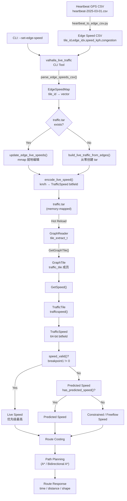
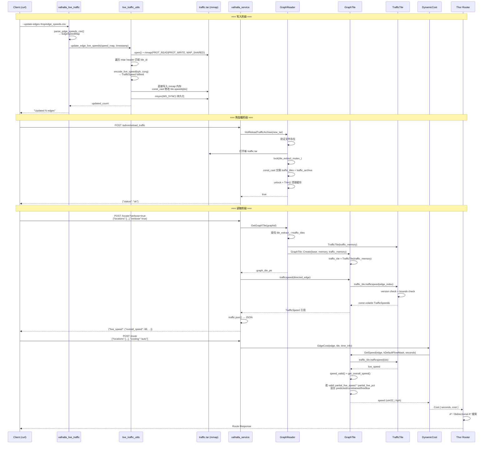
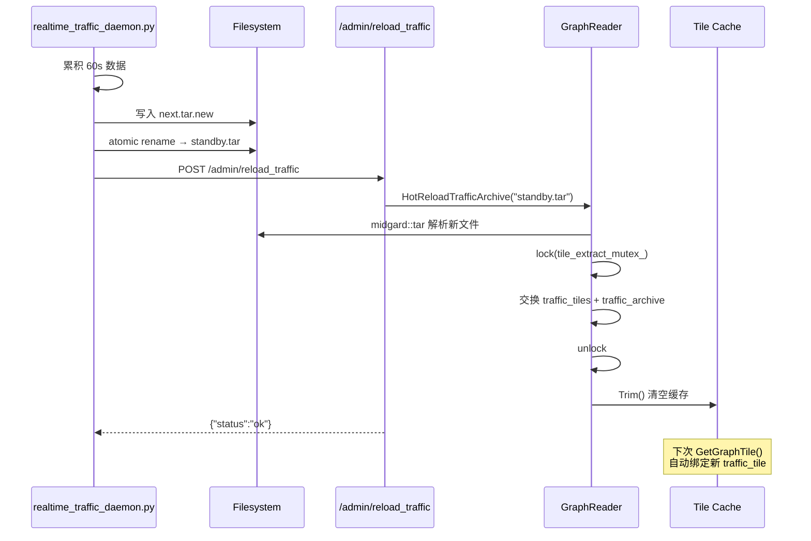
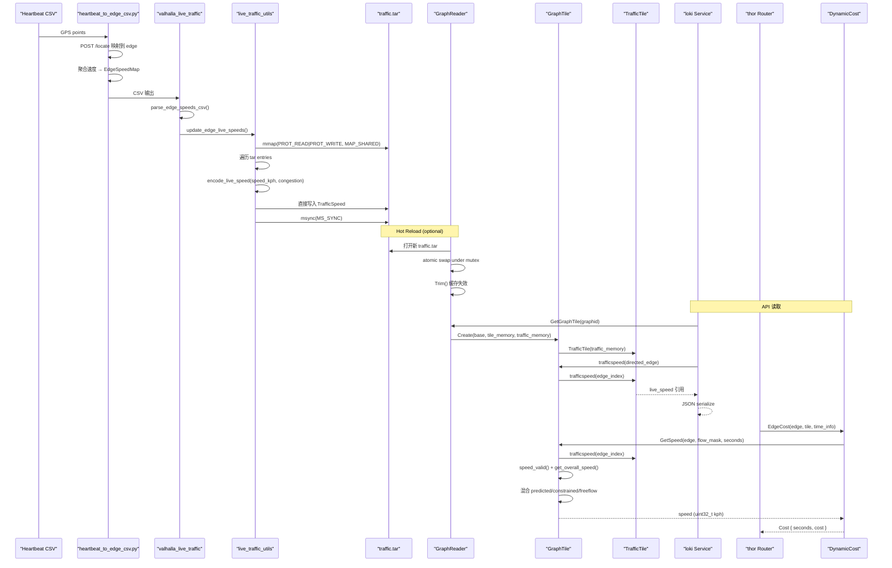
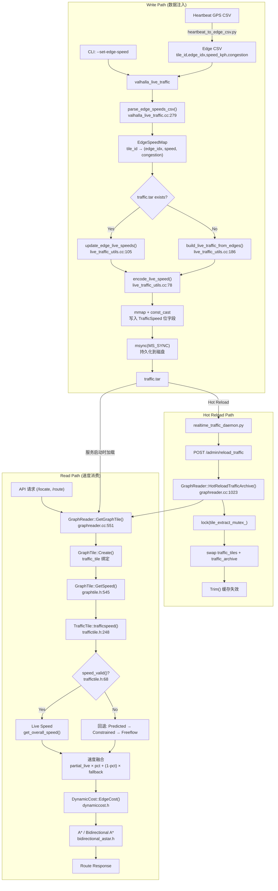

# Real-time Speed Pipeline

> **Valhalla 实时速度流水线 — 从数据注入到路径规划的完整技术文档**

---

## Background

Valhalla 支持两种交通速度数据：

| 类型 | 数据源 | 用途 | 更新方式 |
|------|--------|------|----------|
| **Predicted Traffic** (预测速度) | CSV 文件嵌入 `.gph` tile | 时间相关路由 (date_time) | 离线构建 tile 时注入 |
| **Live Traffic** (实时速度) | `traffic.tar` (mmap) | 实时路由决策 | 运行时热更新，无需重启 |

Live Traffic 优先级高于 Predicted Traffic，且通过 mmap 内存映射实现零拷贝读取。本项目在 Valhalla 原生 live traffic 基础上，新增了**逐边 (per-edge) 速度注入**能力：

- 单边注入 (`--set-edge-speed`)
- CSV 批量注入 (`--update-edges`)
- 从零构建 traffic.tar (`build_live_traffic_from_edges()`)
- 热加载 (Hot Reload) 无需重启 valhalla_service

### 核心原则

- **零核心侵入**: 未修改 Valhalla 核心文件 (`graphtile.h`, `traffictile.h`, `graphreader.h`, `dynamiccost.cc` 等)
- **复用已有架构**: 所有修改通过 `valhalla_code_overwrites/` 文件覆写 + 新增 `live_traffic_utils` 库实现
- **保持兼容**: 与 Valhalla 上游的 `TrafficTile` 格式和 mmap 机制完全兼容

---

## Overall Architecture

```
┌──────────────────────────────────────────────────────────────────────┐
│                        数据注入层 (Write Path)                        │
│                                                                       │
│  heartbeat CSV ──► heartbeat_to_edge_csv.py ──► edge CSV              │
│                                                     │                 │
│  CLI: --set-edge-speed ─────────────────────────────┤                 │
│  CLI: --update-edges ───────────────────────────────┤                 │
│                                                     ▼                 │
│              valhalla_live_traffic (CLI)                               │
│                     │                                                 │
│                     ▼                                                 │
│           live_traffic_utils (library)                                │
│           ├─ encode_live_speed()         ── 速度编码                   │
│           ├─ update_edge_live_speeds()   ── mmap 就地编辑              │
│           └─ build_live_traffic_from_edges() ── 从零创建 tar           │
│                     │                                                 │
│                     ▼                                                 │
│               traffic.tar (mmap'd)                                    │
└──────────────────────────────────────────────────────────────────────┘
                              │
                              │ Hot Reload (无需重启)
                              ▼
┌──────────────────────────────────────────────────────────────────────┐
│                        数据读取层 (Read Path)                          │
│                                                                       │
│  valhalla_service                                                     │
│       │                                                               │
│       ▼                                                               │
│  GraphReader (graphreader.h / graphreader.cc)                        │
│       ├─ tile_extract_t::tile_extract_t()  ── 加载 traffic.tar       │
│       ├─ GetGraphTile()                    ── 创建 GraphTile         │
│       │     └─ traffic_memory 传入 GraphTile::Create()                │
│       └─ HotReloadTrafficArchive()         ── 原子热切换              │
│              │                                                         │
│              ▼                                                         │
│  GraphTile (graphtile.h)                                              │
│       ├─ traffic_tile ── TrafficTile 对象                             │
│       ├─ GetSpeed()   ── 速度融合 (live + predicted + constrained)    │
│       └─ trafficspeed() ── 返回 TrafficSpeed 引用                     │
│              │                                                         │
│              ▼                                                         │
│  TrafficTile (traffictile.h)                                          │
│       ├─ TrafficSpeed  ── 64-bit 位字段                               │
│       └─ trafficspeed(offset) ── 索引边速度                           │
│              │                                                         │
│       ┌─────┴──────────┬──────────────────┐                           │
│       ▼                 ▼                  ▼                           │
│  /locate API       /route API         /trace_attributes               │
│  (查询边速度)       (路径规划)          (地图匹配)                     │
│       │                 │                  │                           │
│       ▼                 ▼                  ▼                           │
│  serializeLocate    DynamicCost         TraceRoute                    │
│  (JSON 返回)        (GetSpeed 调用)     (边序列)                      │
└──────────────────────────────────────────────────────────────────────┘
```

---

## Data Flow

### 完整数据流图



---

## Request Flow

### 时序图



---

## Tile Structure

### traffic.tar 文件布局

```
┌──────────────────────────────────────────────────┐
│  Tar Entry 1 (512-byte header)                    │
│  ┌──────────────────────────────────────────────┐ │
│  │ TrafficTileHeader (32 bytes)                 │ │
│  │   tile_id:             uint64_t              │ │
│  │   last_update:         uint64_t (epoch)      │ │
│  │   directed_edge_count: uint32_t              │ │
│  │   traffic_tile_version: uint32_t (=3)        │ │
│  │   spare2/spare3:       uint32_t × 2          │ │
│  ├──────────────────────────────────────────────┤ │
│  │ TrafficSpeed[0..N-1] (8 bytes each)          │ │
│  │   每 8 bytes 对应 tile 中一条 directed edge   │ │
│  ├──────────────────────────────────────────────┤ │
│  │ Padding (8 bytes, dummy=0)                   │ │
│  └──────────────────────────────────────────────┘ │
│  [512-byte alignment padding]                     │
├──────────────────────────────────────────────────┤
│  Tar Entry 2 ...                                  │
└──────────────────────────────────────────────────┘
```

### TrafficSpeed 位字段 (64 bits = 8 bytes)

```
┌─ 7 bits ─┬─ 7 bits ─┬─ 7 bits ─┬─ 7 bits ─┬─ 8 bits ─┬─ 8 bits ─┬─ 6 bits ─┬─ 6 bits ─┬─ 6 bits ─┬ 1 bit ┬ 1 bit ┐
│ overall  │ speed1   │ speed2   │ speed3   │ breakpt1 │ breakpt2 │ cong1    │ cong2    │ cong3    │ incid  │ spare │
└──────────┴──────────┴──────────┴──────────┴──────────┴──────────┴──────────┴──────────┴──────────┴────────┴───────┘
```

**字段说明**:

| 字段 | 位宽 | 编码规则 |
|------|------|----------|
| `overall_encoded_speed` | 7 bit | `floor(speed_kph / 2)`, 最大值 126 (= 252 km/h) |
| `encoded_speed1/2/3` | 7 bit × 3 | 三子段速度，与 overall 相同时表示整条边统一速度 |
| `breakpoint1` | 8 bit | 子段1 结束位置 = `length × (breakpoint1 / 255)`. `255` = 覆盖全边 |
| `breakpoint2` | 8 bit | 子段2 结束位置 = `length × (breakpoint2 / 255)`. `255` = 不使用子段3 |
| `congestion1/2/3` | 6 bit × 3 | `0`=未知, `1`=畅通, `31`=中度, `63`=严重拥堵 |
| `has_incidents` | 1 bit | 是否有事故信息 |
| `spare` | 1 bit | 预留 |

**速度有效性判断** (`TrafficSpeed::speed_valid()`):

```cpp
// traffictile.h:68-70
inline bool speed_valid() const volatile {
    return breakpoint1 != 0 && overall_encoded_speed != UNKNOWN_TRAFFIC_SPEED_RAW;
}
```

- `breakpoint1 == 0` → 无效，Valhalla 回退到 predicted speed
- `overall_encoded_speed == 127 (UNKNOWN_TRAFFIC_SPEED_RAW)` → 未知速度

**速度解码** (`TrafficSpeed::get_overall_speed()`):

```cpp
// traffictile.h:93-95
inline uint8_t get_overall_speed() const volatile {
    return overall_encoded_speed << 1;  // encoded * 2 = speed_kph
}
```

### TrafficTileHeader (32 bytes)

```cpp
// traffictile.h:185-192
struct TrafficTileHeader {
    uint64_t tile_id;              // GraphId 的 tile base 值
    uint64_t last_update;          // 最后更新时间 (epoch seconds)
    uint32_t directed_edge_count;  // 边数量
    uint32_t traffic_tile_version; // = TRAFFIC_TILE_VERSION (= VALHALLA_VERSION_MAJOR, 当前为 3)
    uint32_t spare2;
    uint32_t spare3;
};
```

### TrafficTile 类

```cpp
// traffictile.h:240-275
class TrafficTile {
public:
    TrafficTile(std::unique_ptr<const GraphMemory> memory)
        : memory_(std::move(memory)),
          header(memory_ ? reinterpret_cast<volatile TrafficTileHeader*>(memory_->data) : nullptr),
          speeds(memory_ ? reinterpret_cast<volatile TrafficSpeed*>(
              memory_->data + sizeof(TrafficTileHeader)) : nullptr) {}

    const volatile TrafficSpeed& trafficspeed(const uint32_t directed_edge_offset) const {
        if (header == nullptr || header->traffic_tile_version != TRAFFIC_TILE_VERSION) {
            return INVALID_SPEED;  // 版本不匹配返回无效速度
        }
        if (directed_edge_offset >= header->directed_edge_count)
            throw std::runtime_error("TrafficSpeed requested for edgeid beyond bounds");
        return *(speeds + directed_edge_offset);
    }

    volatile TrafficTileHeader* header;
    volatile TrafficSpeed* speeds;
};
```

**关键点**: `header` 和 `speeds` 都是 `volatile` 指针，因为 mmap 区域可能被外部进程修改。

---

## Tile Update

### 就地编辑 (In-Place Update via mmap)

`update_edge_live_speeds()` 是核心的增量更新函数，实现 mmap 就地编辑：

```cpp
// live_traffic_utils.cc:105-180
uint32_t update_edge_live_speeds(const boost::property_tree::ptree& mjolnir_pt,
                                 const EdgeSpeedMap& speed_map,
                                 uint64_t timestamp) {
    // 1. 打开 traffic.tar
    auto memory = std::make_shared<MMap>(traffic_path.c_str());

    // 2. 设置 microtar callbacks 操作 mmap 内存
    mtar_t tar;
    tar.stream = memory->data;
    tar.read  = [](mtar_t* t, void* buf, unsigned sz) { memcpy(buf, ...); };
    tar.write = [](mtar_t* t, const void* buf, unsigned sz) { memcpy(...); };

    // 3. 遍历 tar 条目
    while ((mtar_read_header(&tar, &tar_header)) != MTAR_ENULLRECORD) {
        auto tile_id = baldr::GraphTile::GetTileId(tar_header.name);

        // 4. 跳过不在更新列表中的 tile
        if (speed_map.find(tile_id.value) == speed_map.end()) {
            mtar_next(&tar);
            continue;
        }

        // 5. 构造 TrafficTile 指向 mmap 内存
        char* tile_data = reinterpret_cast<char*>(tar.stream) + tar.pos
                        + sizeof(mtar_raw_header_t_);
        baldr::TrafficTile tile(
            std::make_unique<MMapGraphMemory>(memory, tile_data, tar_header.size));

        // 6. 更新时间戳
        const_cast<volatile TrafficTileHeader*>(tile.header)->last_update = timestamp;

        // 7. 更新指定边
        for (const auto& entry : speed_it->second) {
            auto* current = const_cast<TrafficSpeed*>(&tile.speeds[edge_idx]);
            *current = encode_live_speed(speed_kph, congestion);  // 直接写入 mmap
            updated_count++;
        }
        mtar_next(&tar);
    }

    // 8. 同步到磁盘
    msync(memory->data, memory->length, MS_SYNC);
    return updated_count;
}
```

**关键设计决策**:

1. **mmap + const_cast**: Valhalla 设计中 TrafficTile 的 header/speeds 指针是 `volatile` 的，本质预期外部修改。我们使用 `const_cast` 直接写入 mmap 内存，无需重新序列化整个 tar。
2. **零拷贝**: 不需要将 tile 数据读入用户空间缓冲区再写回，直接在 OS 页缓存中操作。
3. **msync 保证持久化**: 确保修改后的页被刷入磁盘。

### 从零构建 (Build from Scratch)

`build_live_traffic_from_edges()` 用于首次创建 traffic.tar：

```cpp
// live_traffic_utils.cc:186-277
uint32_t build_live_traffic_from_edges(const boost::property_tree::ptree& mjolnir_pt,
                                       const EdgeSpeedMap& speed_map,
                                       uint64_t timestamp) {
    // 1. 使用 GraphReader 获取实际 tile 的 directed_edge_count
    baldr::GraphReader reader(mjolnir_pt);

    // 2. 遍历 speed_map 中的每个 tile
    for (const auto& kv : speed_map) {
        auto tile = reader.GetGraphTile(tile_graph_id);
        uint32_t edge_count = tile->header()->directededgecount();

        // 3. 构建 tile 二进制: header + speed 数组 + padding
        std::stringstream buffer;
        // ... write header + TrafficSpeed[edge_count] + padding

        // 4. 写入 tar
        mtar_write_file_header(&tar, filename.c_str(), tile_data.size());
        mtar_write_data(&tar, tile_data.c_str(), tile_data.size());
    }

    mtar_finalize(&tar);
    mtar_close(&tar);
    return filled_count;
}
```

**未指定边的处理**: 写入 `INVALID_SPEED` (breakpoint1=0)，确保 `speed_valid()` 返回 false，Valhalla 自动回退到 predicted speed。

### 速度编码 (encode_live_speed)

```cpp
// live_traffic_utils.cc:78-100
baldr::TrafficSpeed encode_live_speed(float speed_kph, uint8_t congestion) {
    uint32_t raw = static_cast<uint32_t>(speed_kph / 2.0f);
    // Clamp: max = UNKNOWN_TRAFFIC_SPEED_RAW - 1 = 126 (252 km/h)
    if (raw > baldr::UNKNOWN_TRAFFIC_SPEED_RAW - 1)
        raw = baldr::UNKNOWN_TRAFFIC_SPEED_RAW - 1;
    if (congestion > baldr::MAX_CONGESTION_VAL)
        congestion = baldr::MAX_CONGESTION_VAL;

    // 全边覆盖: breakpoint1=255 表示子段1覆盖整条边
    return baldr::TrafficSpeed{
        raw, raw, raw, raw,         // overall_speed, speed1/2/3
        255, 255,                   // breakpoint1=full edge, breakpoint2=unused
        congestion, congestion, congestion,
        0                           // has_incidents = false
    };
}
```

**编码对照**:

| km/h | encoded | `/locate` 返回 |
|------|---------|---------------|
| 3 | 1 | 2 |
| 5 | 2 | 4 |
| 30 | 15 | 30 |
| 60 | 30 | 60 |
| 77 | 38 | 76 |
| 88 | 44 | 88 |
| 120 | 60 | 120 |
| 252 | 126 (max) | 252 |
| ≥254 | 127 (=UNKNOWN) | `null` |

---

## Tile Serialization

### 写入流程

```
EdgeSpeedMap
  │
  ├── update_edge_live_speeds()      [增量编辑]
  │   ├── open + mmap traffic.tar
  │   ├── microtar 遍历匹配 tile
  │   ├── const_cast 写入 TrafficSpeed
  │   └── msync(MS_SYNC) 持久化
  │
  └── build_live_traffic_from_edges() [从零创建]
      ├── GraphReader 获取 edge_count
      ├── encode_live_speed() 编码每条边
      ├── mtar_write_file_header + mtar_write_data
      └── mtar_finalize + mtar_close
```

### 读取流程 (GraphReader)

```cpp
// graphreader.cc:44-164
GraphReader::tile_extract_t::tile_extract_t(const ptree& pt) {
    // 1. 检查配置中的 traffic_extract 字段
    if (pt.get_optional<std::string>("traffic_extract")) {
        // 2. 通过 microtar 加载 traffic.tar
        traffic_archive.reset(new midgard::tar(
            pt.get<std::string>("traffic_extract"), true, index_loader));

        // 3. 遍历 tar 条目，建立 tile_id → (data_ptr, size) 映射
        for (auto& c : traffic_archive->contents) {
            auto id = GraphTile::GetTileId(c.first);
            traffic_tiles[id] = std::make_pair(
                const_cast<char*>(c.second.first), c.second.second);
        }
    }
}
```

### GraphTile 创建时关联 TrafficTile

```cpp
// graphreader.cc:566-590
graph_tile_ptr GraphReader::GetGraphTile(const GraphId& graphid) {
    // 在 mmap 模式下:
    // 1. 查找 traffic_tiles map
    auto traffic_ptr = tile_extract_->traffic_tiles.find(base);
    auto traffic_memory = traffic_ptr != tile_extract_->traffic_tiles.end()
        ? std::make_unique<TarballGraphMemory>(
            tile_extract_->traffic_archive, traffic_ptr->second)
        : nullptr;

    // 2. 创建 GraphTile，传入 traffic_memory
    auto tile = GraphTile::Create(base, std::move(memory), std::move(traffic_memory));
}
```

---

## Hot Reload

### 机制描述

热加载允许在不重启 `valhalla_service` 的情况下替换 `traffic.tar`。

### C++ 端实现

```cpp
// graphreader.cc:1023-1083
bool GraphReader::HotReloadTrafficArchive(const std::string& new_traffic_path) {
    // 1. 验证新文件存在
    if (!filesystem::exists(new_traffic_path)) {
        LOG_ERROR("Traffic archive file does not exist: " + new_traffic_path);
        return false;
    }

    // 2. 加载新的 traffic archive
    std::shared_ptr<midgard::tar> new_archive;
    std::unordered_map<uint64_t, std::pair<char*, size_t>> new_traffic_tiles;

    new_archive = std::make_shared<midgard::tar>(new_traffic_path, true);
    for (auto& c : new_archive->contents) {
        auto id = GraphTile::GetTileId(c.first);
        new_traffic_tiles[id] = std::make_pair(...);
    }

    // 3. 原子切换 (mutex 保护)
    {
        std::lock_guard<std::mutex> lock(tile_extract_mutex_);
        auto* mutable_extract = const_cast<tile_extract_t*>(tile_extract_.get());
        mutable_extract->traffic_archive = std::move(new_archive);
        mutable_extract->traffic_tiles = std::move(new_traffic_tiles);
    }

    // 4. 清理缓存 (下次访问时重新绑 task)
    Trim();
    return true;
}
```

### 双缓冲机制

Python 守护进程 (`realtime_traffic_daemon.py`) 使用双缓冲策略：

```
heartbeat CSV 流
      │
      ▼
realtime_traffic_daemon.py
  ├── 累积 60s 滑动窗口数据
  ├── GPS → edge_index 映射 (_map_to_edge_index)
  ├── 时间衰减加权平均
  ├── 生成 next.tar.new
  ├── 原子 rename → standby.tar
  └── POST /admin/reload_traffic
```

**关键保证**:
- 新 tar 文件准备完成后原子 rename，防止 race condition
- `tile_extract_mutex_` 保护切换操作
- 切换后 Trim() 使旧缓存失效

### 生命周期



---

## GraphReader

### 类结构

```cpp
// graphreader.h:435-977
class GraphReader {
public:
    explicit GraphReader(const boost::property_tree::ptree& pt);

    // 检查是否有 live traffic
    bool HasLiveTraffic() {
        return !tile_extract_->traffic_tiles.empty();
    }

    // 获取 tile (含 traffic_tile 绑定)
    virtual graph_tile_ptr GetGraphTile(const GraphId& graphid);

    // 热加载
    bool HotReloadTrafficArchive(const std::string& new_traffic_path);

protected:
    // 核心数据结构
    struct tile_extract_t {
        tile_extract_t(const boost::property_tree::ptree& pt);
        std::unordered_map<uint64_t, std::pair<char*, size_t>> tiles;         // routing tiles
        std::unordered_map<uint64_t, std::pair<char*, size_t>> traffic_tiles;  // traffic tiles
        std::shared_ptr<midgard::tar> archive;          // routing tile tar
        std::shared_ptr<midgard::tar> traffic_archive;   // traffic tile tar
    };
    std::shared_ptr<const tile_extract_t> tile_extract_;
    mutable std::mutex tile_extract_mutex_;  // 保护热加载切换

    const std::string tile_dir_;
    std::unique_ptr<TileCache> cache_;       // 缓存 GraphTile 对象
};
```

### 读取路径

```
用户请求 → loki/thor worker → GraphReader::GetGraphTile(graphid)
  → 查找 cache → miss
  → 查找 tile_extract_->tiles[base]
  → 查找 tile_extract_->traffic_tiles[base]
  → GraphTile::Create(base, tile_memory, traffic_memory)
    → GraphTile 初始化: header_, nodes_, directedges_, ...
    → traffic_tile = TrafficTile(traffic_memory)
  → 放入 cache
  → 返回 graph_tile_ptr
```

---

## Routing

### GetSpeed — 速度融合核心

```cpp
// graphtile.h:545-657
inline uint32_t GetSpeed(const DirectedEdge* de,
                         uint8_t flow_mask = kConstrainedFlowMask,
                         uint32_t seconds = kInvalidSecondsOfWeek,
                         bool is_truck = false,
                         uint8_t* flow_sources = nullptr,
                         const uint64_t seconds_from_now = 0) const {

    // === Layer 1: Live Traffic (优先级最高) ===
    float live_traffic_multiplier = 1. - std::min(seconds_from_now * LIVE_SPEED_FADE, 1.);
    // LIVE_SPEED_FADE = 1/3600, 即 1 小时后完全衰减
    uint32_t partial_live_speed = 0;
    float partial_live_pct = 0;

    if ((flow_mask & kCurrentFlowMask) && traffic_tile() && live_traffic_multiplier != 0.) {
        auto volatile& live_speed = traffic_tile.trafficspeed(edge_idx);
        if (live_speed.speed_valid() &&
            (partial_live_speed = live_speed.get_overall_speed()) > 0) {
            *flow_sources |= kCurrentFlowMask;
            // 计算覆盖率: breakpoint1=255 → 100%
            if (live_speed.breakpoint1 == 255) {
                partial_live_pct = 1.;
            } else {
                // 按子段加权计算覆盖百分比
                partial_live_pct = (...)/255.0;
            }
            partial_live_pct *= live_traffic_multiplier;
            if (partial_live_pct == 1.) {
                return partial_live_speed;  // 全速返回 live speed
            }
        }
    }

    // === Layer 2: Predicted Traffic ===
    if (!invalid_time && (flow_mask & kPredictedFlowMask) && de->has_predicted_speed()) {
        float speed = predictedspeeds_.speed(idx, seconds);
        if (valid_speed(speed)) {
            *flow_sources |= kPredictedFlowMask;
            return static_cast<uint32_t>(
                partial_live_speed * partial_live_pct +
                (1 - partial_live_pct) * (speed + 0.5f));
        }
    }

    // === Layer 3: Constrained Flow (日间 7am-7pm) ===
    if ((invalid_time || is_daytime) && (flow_mask & kConstrainedFlowMask) &&
        valid_speed(de->constrained_flow_speed())) {
        return static_cast<uint32_t>(
            partial_live_speed * partial_live_pct +
            (1 - partial_live_pct) * de->constrained_flow_speed());
    }

    // === Layer 4: Free Flow (夜间) ===
    if ((invalid_time || !is_daytime) && (flow_mask & kFreeFlowMask) &&
        valid_speed(de->free_flow_speed())) {
        return static_cast<uint32_t>(
            partial_live_speed * partial_live_pct +
            (1 - partial_live_pct) * de->free_flow_speed());
    }

    // === Layer 5: 默认速度 (从 OSM 标签派生) ===
    return static_cast<uint32_t>(
        partial_live_speed * partial_live_pct +
        (1 - partial_live_pct) * de->speed());
}
```

### 速度融合策略

```
                      ┌──────────────────┐
                      │  Live Speed?      │
                      │  speed_valid()?   │
                      └───────┬───────────┘
                              │
                   ┌──────────┴──────────┐
                   │ Yes                  │ No
                   ▼                      ▼
         ┌─────────────────┐   ┌──────────────────┐
         │ breakpoint1=255? │   │ Predicted Speed? │
         └────┬────────┬────┘   └────┬────────┬────┘
              │Yes     │No          │Yes     │No
              ▼        ▼            ▼        ▼
         full live   partial     blend     constrained/
         speed       blend       with      freeflow
                     with        live      speed
                     predicted
```

**时间衰减**: `live_traffic_multiplier = 1 - min(seconds_from_now / 3600, 1.0)`. 距离当前时间越远，live traffic 权重越低，predicted traffic 权重越高。

### Flow Mask

```cpp
// graphconstants.h:640-646
constexpr uint8_t kNoFlowMask         = 0;  // 不使用任何交通数据
constexpr uint8_t kFreeFlowMask       = 1;  // 自由流速度
constexpr uint8_t kConstrainedFlowMask = 2;  // 受限流速度
constexpr uint8_t kPredictedFlowMask  = 4;  // 预测速度
constexpr uint8_t kCurrentFlowMask    = 8;  // 实时速度 (live traffic)
constexpr uint8_t kDefaultFlowMask    = kFreeFlowMask | kConstrainedFlowMask
                                      | kPredictedFlowMask | kCurrentFlowMask;
```

---

## Costing

### DynamicCost 中的速度使用

```cpp
// dynamiccost.h:863-884
// 边是否因 live traffic 关闭
inline virtual bool IsClosed(const baldr::DirectedEdge* edge,
                             const graph_tile_ptr& tile) const {
    return !ignore_closures_ &&
           (flow_mask_ & baldr::kCurrentFlowMask) &&
           tile->IsClosed(edge);  // → traffictile.trafficspeed().closed()
}

// 速度惩罚: 若使用了 live traffic 且速度超过 top_speed，
// 改用 predicted/constrained 计算平均速度
float SpeedPenalty(const baldr::DirectedEdge* edge,
                   const graph_tile_ptr& tile,
                   const baldr::TimeInfo& time_info,
                   uint8_t flow_sources, float edge_speed) const {
    float average_edge_speed = edge_speed;
    if (top_speed_ != baldr::kMaxAssumedSpeed &&
        (flow_sources & baldr::kCurrentFlowMask)) {
        // 计算罚分时临时排除 live traffic
        average_edge_speed = tile->GetSpeed(
            edge, flow_mask_ & (~baldr::kCurrentFlowMask),
            time_info.second_of_week);
    }
    float speed_penalty = (average_edge_speed > top_speed_)
        ? (average_edge_speed - top_speed_) * 0.05f : 0.0f;
    return speed_penalty;
}
```

**设计意图**: 速度惩罚计算时排除 live traffic，因为实时速度可能异常偏高（如凌晨无车时的速度），应使用更平滑的历史数据计算。

### Thor Routing

路由算法 (`bidirectional_astar.h`) 通过 `DynamicCost::EdgeCost()` 获取每条边的穿越代价（时间+成本），其中调用 `GraphTile::GetSpeed()` 获取速度，进而计算 `cost.secs = length / speed`。

---

## Sequence Diagram



---

## Mermaid Flowchart



---

## Important Classes

| 类 | 文件 | 作用 |
|----|------|------|
| `TrafficSpeed` | `valhalla/valhalla/baldr/traffictile.h:53` | 64-bit 位字段，编码单条边的实时速度 |
| `TrafficTileHeader` | `valhalla/valhalla/baldr/traffictile.h:185` | traffic tile 头部 (32 bytes) |
| `TrafficTile` | `valhalla/valhalla/baldr/traffictile.h:240` | 单 tile 的 traffic 数据容器，直接映射 mmap 内存 |
| `GraphReader` | `valhalla/valhalla/baldr/graphreader.h:435` | 管理 tile 访问、缓存、traffic 加载和热切换 |
| `GraphReader::tile_extract_t` | `valhalla/valhalla/baldr/graphreader.h:947` | 保存 tiles + traffic_tiles 的 mmap 映射 |
| `GraphTile` | `valhalla/valhalla/baldr/graphtile.h:500` | 单个路由 tile，持有 `traffic_tile` 成员 |
| `DynamicCost` | `valhalla/valhalla/sif/dynamiccost.h` | 代价计算基类，使用 `GetSpeed()` 计算边代价 |
| `TileCache` | `valhalla/valhalla/baldr/graphreader.h:43` | tile 缓存接口 (Flat/Simple/LRU) |
| `MMap` | `live_traffic_utils.cc:23` (本地) / `valhalla_live_traffic.cc:24` (本地) | RAII mmap 包装器 |
| `MMapGraphMemory` | `live_traffic_utils.cc:63` (本地) / `valhalla_live_traffic.cc:48` (本地) | 桥接 mmap 内存到 `baldr::GraphMemory` |
| `TarballGraphMemory` | `graphreader.cc:537` | 桥接 tar 内容到 `baldr::GraphMemory` |

## Important Functions

| 函数 | 文件:行号 | 作用 |
|------|-----------|------|
| `encode_live_speed()` | `live_traffic_utils.cc:78` | 将 (kph, congestion) 编码为 TrafficSpeed 位字段 |
| `update_edge_live_speeds()` | `live_traffic_utils.cc:105` | mmap 就地编辑 traffic.tar，更新指定边 |
| `build_live_traffic_from_edges()` | `live_traffic_utils.cc:186` | 从 EdgeSpeedMap 创建全新 traffic.tar |
| `parse_edge_speeds_csv()` | `valhalla_live_traffic.cc:279` | 解析 CSV 文件生成 EdgeSpeedMap |
| `handle_set_edge_speed()` | `valhalla_live_traffic.cc:354` | CLI 单边注入处理 |
| `handle_update_edges()` | `valhalla_live_traffic.cc:337` | CLI 批量注入处理 |
| `handle_generate_live_traffic()` | `valhalla_live_traffic.cc:236` | CLI 从零生成单个 tile 的 baseline tar |
| `handle_update_live_traffic()` | `valhalla_live_traffic.cc:259` | CLI 全局覆盖所有 tile 所有边 |
| `GraphReader::HotReloadTrafficArchive()` | `graphreader.cc:1023` | 原子热加载新 traffic.tar |
| `GraphReader::GetGraphTile()` | `graphreader.cc:551` | 获取 tile 同时绑定 traffic_tile |
| `GraphReader::tile_extract_t::tile_extract_t()` | `graphreader.cc:44` | 构造函数：加载 tiles 和 traffic_tiles |
| `GraphTile::GetSpeed()` | `graphtile.h:545` | 速度融合核心：live → predicted → constrained → freeflow → default |
| `GraphTile::trafficspeed()` | `graphtile.h:659` | 通过 directed edge 获取 TrafficSpeed 引用 |
| `GraphTile::IsClosed()` | `graphtile.h:692` | 判断边是否因 live traffic 关闭 |
| `TrafficTile::trafficspeed()` | `traffictile.h:248` | 按 offset 索引 TrafficSpeed (含版本/边界检查) |
| `TrafficSpeed::speed_valid()` | `traffictile.h:68` | 判断 TrafficSpeed 是否有效 (breakpoint1 != 0) |
| `TrafficSpeed::get_overall_speed()` | `traffictile.h:93` | 解码 overall speed (encoded << 1 = kph) |
| `TrafficSpeed::json()` | `traffictile.h:140` | 序列化 TrafficSpeed 为 JSON (含 speed_0/1/2, congestion_0/1/2, breakpoint_0/1) |
| `serialize_edges()` | `locate_serializer.cc:55` | /locate API 响应构建：加入 live_speed 和 predicted_speeds |
| `loki_worker_t::locate()` | `locate_action.cc:19` | /locate API 入口 |
| `DynamicCost::IsClosed()` | `dynamiccost.h:863` | 判断边是否因 traffic 关闭 |
| `DynamicCost::SpeedPenalty()` | `dynamiccost.h:867` | 超速惩罚计算 |

---

## Source Code Location

```
poc/
├── valhalla_code_overwrites/               ← 【本项目的自定义代码】
│   ├── CMakeLists.txt                       # 根 CMake: 注册 valhalla_live_traffic 到 data_tools
│   ├── src/
│   │   ├── CMakeLists.txt                   # 子 CMake: 添加 libvalhalla → live_traffic_utils.cc + microtar
│   │   └── mjolnir/
│   │       ├── live_traffic_utils.h         # [新建] 库头文件: EdgeSpeedMap, encode/update/build 函数声明
│   │       ├── live_traffic_utils.cc        # [新建] 库实现: mmap 编辑、tar 构建、速度编码
│   │       └── valhalla_live_traffic.cc     # [重命名扩展] CLI 工具: --update-edges, --set-edge-speed
│
├── valhalla/                                ← 【Valhalla 上游源码 (不修改核心文件)】
│   ├── valhalla/baldr/
│   │   ├── traffictile.h                    # TrafficSpeed 位字段, TrafficTileHeader, TrafficTile 类
│   │   ├── graphtile.h                      # GraphTile::GetSpeed(), traffic_tile 成员, IsClosed()
│   │   ├── graphreader.h                    # GraphReader 类, HasLiveTraffic(), HotReloadTrafficArchive()
│   │   └── graphconstants.h                 # Flow Mask 常量 (kCurrentFlowMask 等)
│   ├── src/baldr/
│   │   └── graphreader.cc                   # tile_extract_t 构造函数, GetGraphTile(), HotReloadTrafficArchive()
│   ├── src/loki/
│   │   └── locate_action.cc                 # /locate API 入口
│   ├── src/tyr/
│   │   └── locate_serializer.cc             # serialize_edges(): 构建 verbose 响应含 live_speed
│   ├── valhalla/sif/
│   │   └── dynamiccost.h                    # DynamicCost: IsClosed(), SpeedPenalty(), flow_mask()
│   └── valhalla/thor/
│       └── bidirectional_astar.h            # 双向 A* 路由算法
│
├── tests/
│   └── scripts/
│       └── heartbeat_to_edge_csv.py         # [新建] Heartbeat GPS → Edge CSV 转换脚本
│
├── realtime_traffic_daemon.py               # Hot Reload 守护进程
├── build.sh                                 # 构建脚本 (包含 overwrite 文件复制)
├── Dockerfile                               # Docker 构建
└── docs/
    ├── live-traffic-per-edge-injection.md   # 用户手册 (CLI 参考)
    ├── manual-test-procedure.md             # 人工测试流程
    └── realtime_speed_pipeline.md           # 【本文档】技术架构文档
```

---

## Performance Analysis

### mmap 零拷贝设计

- **读取**: Valhalla 通过 mmap 将 traffic.tar 映射到进程地址空间，`TrafficTile::trafficspeed()` 直接通过指针偏移访问，无系统调用、无用户态缓冲拷贝。
- **写入 (update)**: `update_edge_live_speeds()` 同样通过 mmap + const_cast 直接写入，仅修改被更新的边对应的 8-byte TrafficSpeed，无需读取-修改-写回整个文件。
- **写入 (build)**: `build_live_traffic_from_edges()` 使用内存缓冲 + mtar 批量写入，适合首次创建或全量重建场景。

### 时间复杂度

| 操作 | 复杂度 | 说明 |
|------|--------|------|
| `update_edge_live_speeds()` | O(T + E) | T = tar 中 tile 数, E = 要更新的边数 |
| `build_live_traffic_from_edges()` | O(S × D) | S = speed_map 中 tile 数, D = 每 tile 的 edge count |
| `GetSpeed()` | O(1) | 直接数组索引，无分支预测失败关键路径 |
| `HotReloadTrafficArchive()` | O(T) | 解析新 tar 所有条目 |

### 内存占用

- traffic.tar 大小 ≈ `32 bytes header + 8 bytes × edge_count + 8 bytes padding` per tile
- 香港区域约 5 个 tile × 610 edges/tile ≈ 5 × (32 + 4880 + 8) ≈ 25 KB
- mmap 按需分页加载，实际 RSS 通常更小

---

## Design Advantages

1. **零核心侵入**: 未修改 Valhalla 核心引擎的任何文件。所有新增代码通过库 (live_traffic_utils) 和 CLI 扩展 (valhalla_live_traffic) 实现，与上游保持兼容。

2. **mmap 就地编辑**: 利用 Valhalla 已有的 mmap 机制，增量更新只需修改 8-byte TrafficSpeed 字段，无需重新序列化整个 tar。

3. **原子热加载**: `HotReloadTrafficArchive()` 在 mutex 保护下原子交换 `traffic_tiles` map 和 `traffic_archive` 指针，确保路由请求不会读取到不完整的数据。

4. **速度融合策略**: `GetSpeed()` 的 5 层回退 (live → predicted → constrained → freeflow → default) 加上时间衰减，确保路由结果在实时数据和历史数据之间平滑过渡。

5. **灵活注入粒度**: 支持单边 (--set-edge-speed)、批量 CSV (--update-edges)、从零构建 (build_live_traffic_from_edges) 三种注入方式，覆盖调试、测试、产线全场景。

6. **volatile + const_cast 的合理使用**: Valhalla 设计中 TrafficTile 的 header/speeds 指针就是 `volatile` 的（预期外部修改），我们的写入侧使用 `const_cast` 与此设计意图一致。

---

## Limitations

1. **单 tile 生成限制**: `--generate-live-traffic` 一次只能生成一个 tile。多 tile 场景需要使用 `build_live_traffic_from_edges()` 库函数或多次调用 CLI。

2. **无 tile 即静默跳过**: `update_edge_live_speeds()` 对不在 tar 中的 tile 静默跳过（`mtar_next()`），不会报错。需要调用方确认 `Updated N edges` 输出与预期一致。

3. **2 kph 分辨率的精度损失**: 速度按 `floor(speed_kph / 2)` 编码，解码为 `encoded × 2`。77 km/h 编码为 38，解码为 76 km/h，精度损失约 1.3%。

4. **无事务保证**: mmap 写入不是原子的。如果在写入过程中服务读取，可能看到部分更新的 TrafficSpeed（虽然 8-byte 写入在 x86-64 上通常是原子的）。

5. **tar 格式限制**: microtar 不支持 tar 条目的删除或插入，仅支持就地覆盖。如果需要增加新 tile，需要重建整个 tar。

6. **速度上限 252 km/h**: 7-bit 编码的设计上限。超过该值被 clamp 到 252 km/h。

---

## Future Improvements

1. **多 tile 批量生成**: 扩展 `--generate-live-traffic` 支持一次生成多个 tile 的 baseline。
2. **增量 tar 更新**: 支持向已有 tar 追加新 tile 条目（修改 microtar 层或换用 libarchive）。
3. **写入原子性**: 使用双缓冲或 journal 机制保证更新原子性。
4. **subsegment 速度**: 支持 edge 内多子段速度（使用 breakpoint1/breakpoint2 和 speed1/speed2/speed3）。
5. **可视化仪表盘**: 提供实时速度注入状态的 Web 监控页面。
6. **时钟同步**: 支持从 heartbeat 数据中提取时间戳而非使用系统时间。
