# Valhalla 实时速度（Live Traffic）系统 — 完整技术指南

> **文档目标**：让第一次接触本项目的开发者，先学会使用，再理解原理——仅阅读这份文档，就能完整掌握实时速度功能的设计、实现、运行和维护。
>
> **文档版本**：2.0  
> **最后更新**：2026-07-01  
> **适用项目**：`valhalla_hotreload` — 基于 Valhalla 路由引擎的逐边实时速度注入与热加载方案

---

# 目录

- [第一章：项目概述](#第一章项目概述)
- [第二章：环境与安装](#第二章环境与安装)
- [第三章：快速开始](#第三章快速开始)
- [第四章：核心概念](#第四章核心概念)
- [第五章：使用指南](#第五章使用指南)
- [第六章：系统架构](#第六章系统架构)
- [第七章：原始 Valhalla 工作流程](#第七章原始-valhalla-工作流程)
- [第八章：Realtime Speed 嵌入设计](#第八章realtime-speed-嵌入设计)
- [第九章：所有修改点](#第九章所有修改点)
- [第十章：关键源码分析](#第十章关键源码分析)
- [第十一章：完整调用链](#第十一章完整调用链)
- [第十二章：数据流与时序分析](#第十二章数据流与时序分析)
- [第十三章：设计思想与对比](#第十三章设计思想与对比)
- [第十四章：代码阅读指南](#第十四章代码阅读指南)
- [第十五章：总结与展望](#第十五章总结与展望)

---

# 第一章：项目概述

## 1.1 这是什么？

本项目为 [Valhalla](https://github.com/valhalla/valhalla) 路由引擎提供**逐边实时速度注入**与**热加载**能力。

简单来说：你可以向 Valhalla 的路网数据中注入"此时此刻"的道路速度（例如"某某路段现在堵车，速度只有 5 km/h"），路由引擎会立即使用这些实时数据计算最优路径——**无需重启服务，无需重新构建瓦片**。

```
外部实时速度数据 ──→ 本项目 ──→ traffic.tar ──→ Valhalla 路由引擎 ──→ 基于实时路况的最优路径
```

## 1.2 为什么需要它？

Valhalla 原生的速度来源都是静态的：

| 速度类型 | 来源 | 局限性 |
|---------|------|--------|
| Free Flow Speed | OSM 标签（如 `maxspeed`） | 不能反映拥堵 |
| Constrained Flow Speed | OSM 标签 | 只有白天/夜间两档 |
| Predicted Speed | 历史统计数据 | 基于"通常"情况，不是"此刻" |

**实时速度（Live Speed）要解决的核心问题**：让路由决策基于"此刻"的道路状况，而不是"通常"的道路状况。

> 场景：用户在下班高峰期请求路线。如果系统只知道"这条路通常限速 60 km/h"，它可能推荐一条实际上已经堵了 2 公里的路。而如果系统知道"这条路现在的速度只有 5 km/h"，它就会推荐另一条更快的路线。

## 1.3 Valhalla 已有的 vs 本项目新增的

Valhalla **已经内置了**实时速度的读取路径（`TrafficTile`、`GetSpeed()` 的 Live Speed 层），但**缺少写入路径**——没有工具能将外部实时数据注入到 `traffic.tar` 中。

| 能力 | Valhalla 原生 | 本项目 |
|------|:---:|:---:|
| 实时速度读取（消费） | ✅ | —（复用） |
| 实时速度写入（生产） | ❌ | ✅ |
| 逐边精度控制 | ❌ | ✅ |
| CSV 批量注入 | ❌ | ✅ |
| 热加载（Hot Reload） | ❌ | ✅ |
| 修改核心引擎文件 | — | ❌ 零侵入 |

## 1.4 核心特性一览

| 特性 | 说明 |
|------|------|
| **单边注入** | `--set-edge-speed` 精确控制一条边的速度，适合调试 |
| **批量注入** | `--update-edges` 从 CSV 批量注入，适合产线管道 |
| **从零构建** | `build_live_traffic_from_edges()` 无需预先存在的 traffic.tar |
| **Hot Reload** | 速度变更无需重启 `valhalla_service` |
| **速度编码** | 自动将 km/h 转换为 TrafficSpeed 64-bit 位字段（2 kph 分辨率） |
| **零核心侵入** | 未修改 `graphtile.h`、`traffictile.h`、`graphreader.h`、`dynamiccost.cc` 等核心文件 |

---

# 第二章：环境与安装

## 2.1 系统要求

| 依赖 | 版本要求 | 说明 |
|------|---------|------|
| 操作系统 | Ubuntu 20.04+ / Debian 11+ | 其他 Linux 需自行适配 |
| CMake | ≥ 3.12 | 构建系统 |
| C++ | ≥ 14 | 语言标准 |
| Boost | ≥ 1.71 | `property_tree`、`algorithm` |
| Docker | ≥ 20.10 | （推荐）Docker 方式构建 |

## 2.2 方式一：Docker 构建（推荐）

```bash
cd poc
docker build -t valhalla-live-traffic:v1 .
docker run -d --name valhalla-live -p 8002:8002 valhalla-live-traffic:v1 sleep infinity
docker exec -it valhalla-live bash
```

**构建产物**：
- `valhalla_service` — HTTP 路由服务
- `valhalla_live_traffic` — 实时速度 CLI 工具
- `valhalla_tiles/` — 香港路由瓦片
- `valhalla.json` — 服务配置文件（已预置 `traffic_extract` 配置）

## 2.3 方式二：手动构建

### Step 1：编译 prime_server

```bash
cd poc/prime_server
./autogen.sh && ./configure && make install -j1
```

### Step 2：复制覆盖文件

```bash
cd poc
cp valhalla_code_overwrites/src/mjolnir/live_traffic_utils.h   valhalla/src/mjolnir/
cp valhalla_code_overwrites/src/mjolnir/live_traffic_utils.cc  valhalla/src/mjolnir/
cp valhalla_code_overwrites/src/mjolnir/valhalla_live_traffic.cc valhalla/src/mjolnir/
cp valhalla_code_overwrites/CMakeLists.txt                      valhalla/
cp valhalla_code_overwrites/src/CMakeLists.txt                  valhalla/src/
```

### Step 3：编译 Valhalla

```bash
cd poc/valhalla
mkdir -p build && cd build
cmake .. -DCMAKE_BUILD_TYPE=Release -DENABLE_SINGLE_FILES_WERROR=False
make -j$(nproc) install
```

### Step 4：生成路由瓦片

```bash
cd poc/valhalla_tiles
valhalla_build_config \
    --mjolnir-tile-dir ./valhalla_tiles \
    --mjolnir-traffic-extract ./traffic.tar > valhalla.json
valhalla_build_tiles -c valhalla.json your_region.osm.pbf
```

## 2.4 验证安装

```bash
# 确认 CLI 工具可用
valhalla_live_traffic --help | head -5

# 确认配置正确
grep "traffic_extract" valhalla_tiles/valhalla.json
```

**预期输出**：
```
  - Provides utilities for adding live traffic to valhalla routing tiles.
  -h, --help          Print this help message.
  -c, --config arg    Path to the json configuration file.
  ...
"traffic_extract": "/valhalla_tiles/traffic.tar"
```

---

# 第三章：快速开始

> 假设你已经完成了 Docker 构建，并且 `valhalla_service` 尚未启动。

## 3.1 初始化 traffic.tar

首次使用需要创建一个 baseline `traffic.tar`（告诉 Valhalla："这些 tile 有实时交通数据"）：

```bash
valhalla_live_traffic \
  --config /valhalla_tiles/valhalla.json \
  --generate-live-traffic "2/647736/0,30,$(date +%s)"
```

| 参数 | 含义 |
|------|------|
| `2/647736/0` | tile 坐标 (level=2, tile_index=647736, id=0) |
| `30` | baseline 编码速度 = 60 km/h (`30 × 2 = 60`) |
| `$(date +%s)` | 当前 epoch 时间戳 |

**预期输出**：
```
Generated traffic.tar successfully at /valhalla_tiles/traffic.tar
```

## 3.2 启动服务

```bash
LD_LIBRARY_PATH=/usr/local/lib valhalla_service /valhalla_tiles/valhalla.json 1 &
sleep 3
curl -s http://localhost:8002/status | head -c 100
```

## 3.3 注入第一条实时速度

```bash
# 将 tile 2/647736/0 的第 370769 条边速度设为 77 km/h，畅通
valhalla_live_traffic --config /valhalla_tiles/valhalla.json \
  --set-edge-speed "2/647736/0,370769,77,6"
```

**预期输出**：
```
Updated 1 edges in /valhalla_tiles/traffic.tar
```

## 3.4 验证注入效果

```bash
curl -s http://localhost:8002/locate?verbose=true \
  -H "Content-Type: application/json" \
  -d '{"locations":[{"lat":22.3430,"lon":114.1986}],"verbose":true}' \
  | python3 -c "
import json, sys
resp = json.load(sys.stdin)
for e in resp[0].get('edges', [])[:3]:
    ei = e.get('edge_id', {})
    ls = e.get('live_speed', {})
    print(f'edge[{ei.get(\"id\",\"?\")}]: live={ls.get(\"overall_speed\",\"none\")} kph')
"
```

**预期**：注入过的边显示 `live=76 kph`（77 / 2 × 2 = 76，编码精度 ±2 kph），未注入边显示 `live=none kph`。

## 3.5 注入拥堵路段

```bash
# 将另一条边设为 5 km/h 严重拥堵
valhalla_live_traffic --config /valhalla_tiles/valhalla.json \
  --set-edge-speed "2/647736/0,370770,5,51"
```

## 3.6 验证 Hot Reload

```bash
# 修改之前注入的边：77 → 3 km/h（极端变化便于观察）
valhalla_live_traffic --config /valhalla_tiles/valhalla.json \
  --set-edge-speed "2/647736/0,370769,3,63"

# 立即查询（无需重启服务！）
curl -s http://localhost:8002/locate?verbose=true \
  -H "Content-Type: application/json" \
  -d '{"locations":[{"lat":22.3430,"lon":114.1986}],"verbose":true}' \
  | python3 -c "import json,sys; e=json.load(sys.stdin)[0]['edges'][0]; print(e.get('live_speed',{}).get('overall_speed','none'), 'kph')"
```

**预期**：输出 `2 kph`（3 / 2 × 2 = 2），且**没有重启 valhalla_service**。

## 3.7 批量注入（CSV）

```bash
# 准备 CSV 文件
cat > /tmp/edge_speeds.csv << 'EOF'
# tile_id, edge_index, speed_kph, congestion
2/647736/0,370769,77.0,6
2/647736/0,370770,55.0,16
2/647736/0,370771,32.0,31
EOF

# 批量注入
valhalla_live_traffic --config /valhalla_tiles/valhalla.json \
  --update-edges /tmp/edge_speeds.csv
```

**预期输出**：
```
Updated 3 edges in /valhalla_tiles/traffic.tar
```

## 3.8 路由查询

```bash
curl -s "http://localhost:8002/route" \
  -H "Content-Type: application/json" \
  -d '{
    "locations": [
      {"lat": 22.280, "lon": 114.160},
      {"lat": 22.320, "lon": 114.190}
    ],
    "costing": "auto",
    "directions_options": {"units": "km"}
  }' | python3 -c "
import json, sys
s = json.load(sys.stdin)['trip']['summary']
print(f'time={s[\"time\"]}s, length={s[\"length\"]}km')
"
```

**预期**：返回合理的路由时间和距离。注入更高速度 → 时间缩短；注入更低速度 → 时间增加。

---

# 第四章：核心概念

> 在深入使用和开发之前，理解这几个核心概念至关重要。

## 4.1 Tile（瓦片）

Valhalla 将地球表面按层级切割为矩形瓦片。每个瓦片是一个 `.gph` 文件，包含该区域内的所有道路数据。

| 层级 | 覆盖范围 | 瓦片数量（全球） | 典型用途 |
|------|---------|:---:|---------|
| Level 0 | 最大（约 1°×1°） | 数千 | 高速公路、长途路由 |
| Level 1 | 中等 | 数万 | 主干道、中距离路由 |
| Level 2 | 最小（约 0.25°×0.25°） | 数十万 | 本地街道、精确路由 |

每条边（edge）都有一个全局唯一的 64 位 `GraphId`，编码了三个信息：

```
┌─21bit──┬─22bit────┬─3bit──┬─...┐
│ edge_id│ tile_index│ level │... │
└────────┴──────────┴───────┴────┘
```

## 4.2 Edge（有向边）

在 Valhalla 的路网模型中，一条物理道路被表示为**多条有向边（DirectedEdge）**：

- 双向道路 = 2 条有向边（正向 + 反向）
- 单向道路 = 1 条有向边
- 每条有向边都在某个 Tile 内部有一个唯一的 `edge_index`（即它在 `DirectedEdge[]` 数组中的偏移量）

**本项目的核心操作**：通过 `(tile_id, edge_index)` 精确定位到路网中的一条边，然后修改它的实时速度。

## 4.3 TrafficSpeed — 实时速度的载体

`TrafficSpeed` 是一个 64 位（8 字节）的位字段结构体：

```
┌─7bit──┬─7bit──┬─7bit──┬─7bit──┬─8bit──┬─8bit──┬─6bit──┬─6bit──┬─6bit──┬1bit─┬1bit─┐
│overall│speed1 │speed2 │speed3 │break1 │break2 │cong1  │cong2  │cong3  │incid│spare│
└───────┴───────┴───────┴───────┴───────┴───────┴───────┴───────┴───────┴─────┴─────┘
```

| 字段 | 位宽 | 说明 |
|------|:---:|------|
| `overall_encoded_speed` | 7 bit | 整条边的平均速度编码值，2 kph 分辨率 |
| `encoded_speed1/2/3` | 各 7 bit | 三个子段的速度（本项目设为相同值，表示全边统一） |
| `breakpoint1` | 8 bit | 第一个子段覆盖的边长百分比（`255` = 100%） |
| `breakpoint2` | 8 bit | 第二个子段覆盖的边长百分比 |
| `congestion1/2/3` | 各 6 bit | 三个子段的拥堵程度（`0`=未知, `1`=畅通, `63`=严重拥堵） |
| `has_incidents` | 1 bit | 是否有交通事故 |
| `spare` | 1 bit | 预留 |

**速度编码公式**：
```
encoded_value = floor(speed_kph / 2)
get_overall_speed() = encoded_value × 2
```

**有效性判定**（`speed_valid()`）：
```cpp
breakpoint1 != 0 && overall_encoded_speed != 127  // 127 = UNKNOWN
```

**关键设计**：一个 `TrafficSpeed` 恰好 64 位 = 8 字节 = 一个 `uint64_t`。在 x86-64 架构上，对齐的 8 字节读写是原子的——这意味着 Valhalla 读取速度时永远不会读到"写了一半"的脏数据。

## 4.4 traffic.tar — 实时速度的存储容器

`traffic.tar` 是一个标准的 tar 归档文件，内部结构如下：

```
traffic.tar
├── [tar header 512B] 0/003/015.gph
│   ├── TrafficTileHeader (32 bytes)
│   │   ├── tile_id: uint64_t
│   │   ├── last_update: uint64_t (epoch seconds)
│   │   ├── directed_edge_count: uint32_t
│   │   └── traffic_tile_version: uint32_t
│   ├── TrafficSpeed[0] (8 bytes)
│   ├── TrafficSpeed[1] (8 bytes)
│   ├── ...
│   ├── TrafficSpeed[edge_count-1] (8 bytes)
│   └── padding (8 bytes)
├── [tar header 512B] 0/003/016.gph
│   └── ...
└── [tar terminator 1024B]
```

**关键约定**：`TrafficSpeed[i]` 对应瓦片中的第 `i` 条有向边（`DirectedEdge[i]`）——数组索引严格一一对应。

**数据结构内存布局关系**：

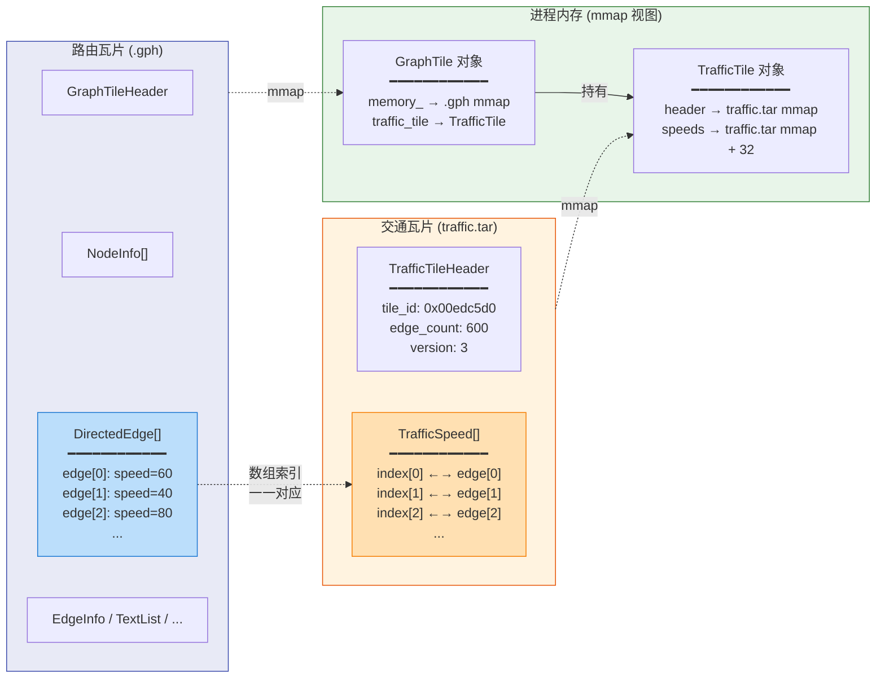

> **核心关系**：`GraphTile` 同时持有两个独立 mmap —— 路由数据（`.gph`）和交通数据（`traffic.tar`）。`DirectedEdge[i]` 和 `TrafficSpeed[i]` 通过相同的数组索引建立联系。

## 4.5 GetSpeed() 的 5 层速度融合

当 Valhalla 需要获取一条边的通行速度时，`GraphTile::GetSpeed()` 按以下优先级逐层查询：

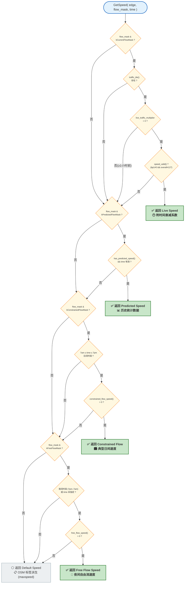

**Live Speed 还有一个时间衰减机制**：距离当前时间越远，live speed 权重越低（1 小时后衰减为 0），自动 fallback 到下层速度。这反映了一个直觉——"我现在知道这条路堵，但 30 分钟后它可能就不堵了"。

---

# 第五章：使用指南

## 5.1 CLI 命令参考

所有命令通过 `valhalla_live_traffic` 二进制执行，必须指定 `--config` 参数。

### 5.1.1 `--generate-live-traffic` — 初始化 traffic.tar

```bash
valhalla_live_traffic --config <config> \
  --generate-live-traffic "<tile_id>,<encoded_speed>,<timestamp>"
```

| 参数 | 类型 | 说明 |
|------|------|------|
| `tile_id` | string | `level/tile_index/0` 格式 |
| `encoded_speed` | uint32 | baseline 编码速度，`kph / 2`。60 km/h → `30` |
| `timestamp` | uint64 | epoch 秒时间戳 |

> ⚠️ 每次只生成一个 tile。多 tile 场景建议用 `build_live_traffic_from_edges()` 库函数。

### 5.1.2 `--set-edge-speed` — 单边注入

```bash
valhalla_live_traffic --config <config> \
  --set-edge-speed "<tile_id>,<edge_idx>,<speed_kph>[,<congestion>]"
```

| 参数 | 类型 | 必填 | 默认值 | 说明 |
|------|------|:---:|--------|------|
| `tile_id` | string | 是 | — | `level/tile_index/0` 格式 |
| `edge_idx` | uint32 | 是 | — | 边在 tile 内的偏移量 |
| `speed_kph` | float | 是 | — | 速度 km/h，范围 0–252，精度 2 kph |
| `congestion` | uint8 | 否 | `1` | 拥堵程度 1–63 |

可多次指定以注入多条边：

```bash
valhalla_live_traffic --config valhalla.json \
  --set-edge-speed "2/647736/0,370769,77,6" \
  --set-edge-speed "2/647736/0,371000,45,31"
```

### 5.1.3 `--update-edges` — CSV 批量注入

```bash
valhalla_live_traffic --config <config> --update-edges <csv_path>
```

**CSV 格式**：

```csv
# 注释行以 # 开头，自动跳过
# tile_id, edge_index, speed_kph, congestion
2/647736/0,370769,77.0,6
2/647736/0,370770,55.0,16
2/647735/0,12345,32.0,31      # congestion 列可选（默认 1）
```

**Tile ID 支持两种格式**：
- `level/tile_index/id`（如 `2/647736/0`）—— 与 `/locate` API 返回的格式一致
- Raw `uint64_t`（如 `325892112389`）—— `GraphId.value` 的十进制值

### 5.1.4 `--update-live-traffic` — 全局覆盖

```bash
# 将 traffic.tar 中所有 tile 的所有边统一设为同一速度
valhalla_live_traffic --config valhalla.json --update-live-traffic 60
```

### 5.1.5 辅助命令

| 命令 | 示例 | 说明 |
|------|------|------|
| `--help` | `valhalla_live_traffic --help` | 打印所有选项 |
| `--get-tile-id` | `--get-tile-id 325892112389` | raw GraphId → `level/tile/id` |
| `--get-traffic-dir` | `--get-traffic-dir 325892112389` | 获取 edge 的 traffic 目录路径 |
| `--generate-predicted-traffic` | `--generate-predicted-traffic 40` | 生成 predicted speed 的 base64（调试用） |

## 5.2 速度编码参考

```
encoded_value = floor(speed_kph / 2)
get_overall_speed() = encoded_value × 2
UNKNOWN = 127（7-bit 最大值，表示"速度未知"）
MAX_TRAFFIC_SPEED_KPH = (127 - 1) × 2 = 252 km/h
```

| km/h | encoded (overall_speed) | `/locate` 返回 | 精度损失 |
|------|:---:|---------|:---:|
| 0 | 0 | 0 | — |
| 3 | 1 | 2 | 33% |
| 5 | 2 | 4 | 20% |
| 30 | 15 | 30 | 0% |
| 60 | 30 | 60 | 0% |
| 77 | 38 | 76 | 1.3% |
| 120 | 60 | 120 | 0% |
| 252 | 126 | 252 | 0% |
| ≥254 | 127 (=UNKNOWN) | `null` | — |

> 偶数速度（如 60、120、252）无精度损失。奇数速度损失 ≤ 2 kph（约 ±1.3% at highway speeds）。

## 5.3 拥堵程度建议值

| 拥堵等级 | congestion | 速度范围 | 说明 |
|----------|:---:|---------|------|
| 畅通 | 1–10 | > 40 km/h | 车速正常 |
| 轻度拥堵 | 11–25 | 20–40 km/h | 车流缓慢 |
| 中度拥堵 | 26–40 | 10–20 km/h | 明显排队 |
| 严重拥堵 | 41–55 | < 10 km/h | 基本停滞 |
| 停滞 | 56–63 | ≈ 0 km/h | 道路封闭 |

## 5.4 Hot Reload 使用

`poc/` 模块的 Hot Reload 依赖 mmap 的自动刷新：Valhalla 通过 `volatile` 指针读取 `traffic.tar`，操作系统页缓存在 `msync()` 后自动将修改暴露给读取端（通常毫秒级延迟）。

**手动触发流程**：

```bash
# 1. 修改速度
valhalla_live_traffic --config valhalla.json \
  --set-edge-speed "2/647736/0,370769,5,51"

# 2. 立即查询（无需重启！）
curl -s http://localhost:8002/locate?verbose=true \
  -H "Content-Type: application/json" \
  -d '{"locations":[{"lat":22.3430,"lon":114.1986}],"verbose":true}' \
  | python3 -c "import json,sys; e=json.load(sys.stdin)[0]['edges'][0]; print('live_speed:', e.get('live_speed',{}).get('overall_speed','none'), 'kph')"
```

**`realtime/` 模块的自动 Hot Reload**（需要额外集成）：
- 使用双缓冲机制（`active.tar` ↔ `standby.tar`）
- `realtime_traffic_daemon.py` 持续监听 heartbeat 数据
- 定期重建 `traffic.tar` → 原子 rename → 调用 `HotReloadTrafficArchive()`
- 适合产线 7×24 自动化运行

## 5.5 故障排查

| 症状 | 可能原因 | 解决 |
|------|---------|------|
| `Updated 0 edges` | traffic.tar 为空/损坏 | 执行 `--generate-live-traffic` 初始化 |
| `Tile not found` 警告 | speed_map 中的 tile 在 routing tiles 中不存在 | 检查 tile_id 是否正确，确认对应 `.gph` 文件存在 |
| `Edge index ... out of bounds` | edge_idx ≥ directed_edge_count | 检查 CSV 中的 edge_idx 是否与当前 tile 版本匹配 |
| `/locate` 返回 `live_speed` 为 null | edge 未注入 / breakpoint=0 | 确认 `--update-edges` 返回 `Updated N edges` (N > 0) |
| `traffic.tar not found` | 路径配置错误 | 检查 `valhalla.json` 中 `mjolnir.traffic_extract` 的值 |
| 热加载不生效 | 需要 `msync` 刷新 | 确认 CLI 工具正常退出（RAII 析构执行 munmap 前已 msync） |

---

# 第六章：系统架构

## 6.1 架构总览

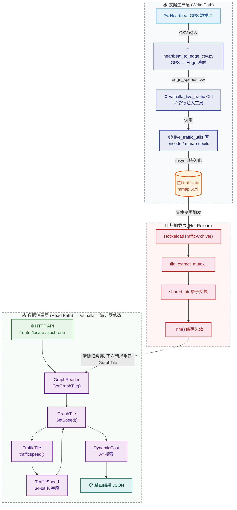

## 6.2 模块职责

| 模块 | 位置 | 职责 |
|------|------|------|
| **live_traffic_utils** | `valhalla_code_overwrites/src/mjolnir/` | 核心库：速度编码、mmap 就地编辑、从零构建 traffic.tar |
| **valhalla_live_traffic** | `valhalla_code_overwrites/src/mjolnir/` | CLI 工具：解析命令行参数，调用 live_traffic_utils |
| **TrafficTile**（上游） | `valhalla/valhalla/baldr/traffictile.h` | 数据结构：TrafficSpeed 位字段、TrafficTile 访问接口 |
| **GraphTile::GetSpeed()**（上游） | `valhalla/valhalla/baldr/graphtile.h` | 速度融合引擎：5 层优先级速度查询 |
| **GraphReader**（上游） | `valhalla/valhalla/baldr/graphreader.h` | 瓦片管理器：加载 traffic.tar，绑定 traffic_memory |
| **DynamicCost**（上游） | `valhalla/valhalla/sif/dynamiccost.h` | 代价计算：使用 live speed 判断道路关闭 |
| **/locate API**（上游） | `valhalla/src/tyr/locate_serializer.cc` | 序列化：将 live_speed 输出到 JSON 响应 |
| **build.sh** | `poc/build.sh` | 构建编排：复制 overlay 文件 → cmake → make |

## 6.4 项目文件结构

```
poc/                                          # ← 项目根目录
│
├── valhalla_code_overwrites/                 # ★ 所有自定义代码（零侵入的关键）
│   ├── CMakeLists.txt                        #   根 CMake — 注册 valhalla_live_traffic
│   ├── src/
│   │   ├── CMakeLists.txt                    #   子 CMake — 添加 live_traffic_utils + microtar
│   │   └── mjolnir/
│   │       ├── live_traffic_utils.h          # ★ 核心库头文件 — EdgeSpeedMap + 3 个函数声明
│   │       ├── live_traffic_utils.cc         # ★ 核心库实现 — encode/mmap in-place edit/build
│   │       └── valhalla_live_traffic.cc      # ★ CLI 工具 — 7 个命令，CSV 解析
│
├── valhalla/                                 # Valhalla 上游源码（子模块，不修改核心文件）
│   ├── valhalla/baldr/
│   │   ├── traffictile.h                     #   TrafficSpeed / TrafficTileHeader / TrafficTile
│   │   ├── graphtile.h                       #   GetSpeed() 5 层融合
│   │   ├── graphreader.h                     #   GraphReader / tile_extract_t
│   │   └── graphconstants.h                  #   Flow mask 常量 kCurrentFlowMask=8
│   ├── src/baldr/graphreader.cc              #   tile_extract_t 构造 / GetGraphTile()
│   ├── src/tyr/locate_serializer.cc          #   serialize_edges() — live_speed JSON 输出
│   └── valhalla/sif/dynamiccost.h            #   IsClosed() / SpeedPenalty()
│
├── realtime/                                 # Hot Reload 扩展模块（可选集成）
│   ├── src/baldr/
│   │   ├── graphreader_hot_reload.h          #   HotReloadTrafficArchive() 声明
│   │   ├── graphreader_hot_reload.cc         #   HotReloadTrafficArchive() 实现
│   │   └── realtime_traffic_updater.h/.cc    #   RealtimeTrafficUpdater 类
│   └── scripts/realtime_traffic_daemon.py    #   Python 守护进程
│
├── valhalla_tiles/                           # 路由瓦片数据（运行时生成）
│   ├── valhalla.json                         #   服务配置（含 traffic_extract 路径）
│   └── traffic.tar                           # ★ 实时速度文件（CLI 写入，Valhalla mmap 读取）
│
├── docs/                                     # 文档
│   └── valhalla_realtime_speed_comprehensive_guide.md
│
├── build.sh                                  # 构建脚本（复制 overlay → cmake → make）
├── Dockerfile                                # Docker 构建
└── tests/                                    # 测试脚本和数据
    ├── scripts/heartbeat_to_edge_csv.py      #   GPS → Edge CSV 转换
    └── data/heartbeat/                       #   测试用 heartbeat 数据
```

> ★ 标记的文件是本项目自定义的核心文件。其余文件均为 Valhalla 上游（未修改）或辅助脚本。

## 6.3 数据流动全景

```
                    ┌─────────────────────────────────────────────┐
                    │         数据生产 (Write Path)                 │
                    │                                              │
    GPS 数据 ──→ heartbeat_to_edge_csv.py ──→ edge_speeds.csv      │
                                                  │                │
                                                  ▼                │
                    valhalla_live_traffic CLI                       │
                      │         │         │                        │
                      ▼         ▼         ▼                        │
                    --set-   --update-  --generate-                │
                    edge-    edges      live-                      │
                    speed    (CSV)      traffic                    │
                      │         │         │                        │
                      └─────────┼─────────┘                        │
                                ▼                                  │
                    live_traffic_utils 库                           │
                      │         │         │                        │
                      ▼         ▼         ▼                        │
                  encode_   update_   build_                       │
                  live_     edge_     live_                        │
                  speed()   live_     traffic_                     │
                            speeds()  from_                        │
                                      edges()                      │
                                │                                  │
                                ▼                                  │
                    traffic.tar (mmap 文件)                         │
                    └──────────────────┬──────────────────────────┘
                                       │
                    ┌──────────────────▼──────────────────────────┐
                    │         数据消费 (Read Path)                  │
                    │                                              │
    HTTP 请求 ──→ GraphReader::GetGraphTile()                       │
                       │                                           │
                       ▼                                           │
                  GraphTile::Create(base, memory, traffic_memory)   │
                       │                                           │
                       ▼                                           │
                  GraphTile::GetSpeed(edge, flow_mask, time)        │
                       │                                           │
                       ▼                                           │
                  Layer 1: Live Speed (实时)  ◄── traffic.tar       │
                  Layer 2: Predicted Speed (预测)                    │
                  Layer 3: Constrained Flow (白天)                   │
                  Layer 4: Free Flow (夜间)                         │
                  Layer 5: Default Speed (OSM 默认)                 │
                       │                                           │
                       ▼                                           │
                  DynamicCost → A* 搜索 → 最优路径                   │
                       │                                           │
                       ▼                                           │
                  JSON Response                                    │
                    └──────────────────────────────────────────────┘
```

---

# 第七章：原始 Valhalla 工作流程

## 7.1 请求处理全链路

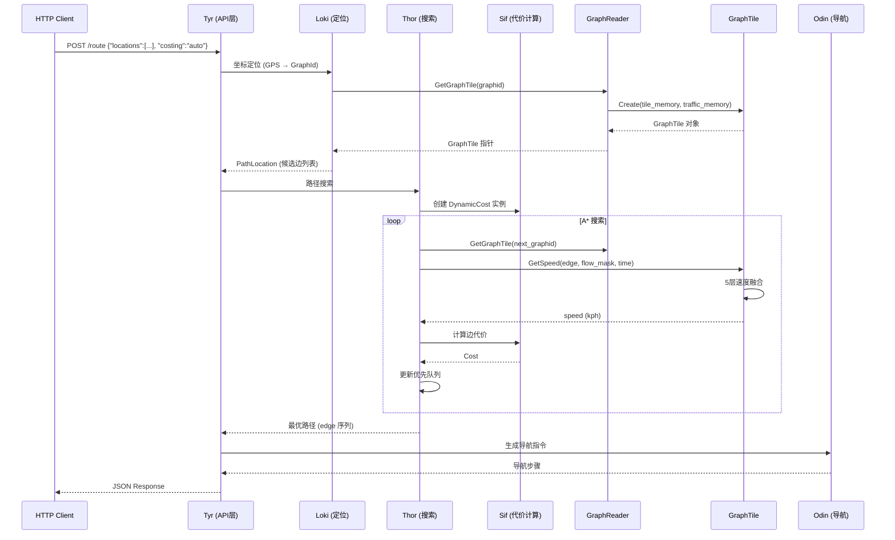

## 7.2 各模块说明

### Tyr（API 层）

**职责**：HTTP 请求的入口和出口。

**输入 → 输出**：HTTP JSON 请求 → JSON 响应（路径几何、导航指令、行程摘要）。

**设计意图**：将 HTTP 协议处理与路由逻辑分离。Tyr 只负责解析和序列化，不参与路由计算。

### Loki（定位层）

**职责**：将 GPS 坐标（经纬度）映射到路网中的具体边。

**输入 → 输出**：经纬度坐标 + 搜索半径 → `PathLocation`（候选边列表，含 `GraphId`、投影点、距离）。

**设计意图**：GPS 坐标是连续空间中的点，而路网是离散的边集合。Loki 通过几何投影算法建立这个桥梁。

### Thor（路径搜索层）

**职责**：执行双向 A* 搜索算法，找到最优路径。

**输入 → 输出**：起点/终点 `PathLocation` + `DynamicCost` → 有向边有序序列。

**设计意图**：双向 A* 从起点和终点同时搜索，在中间"相遇"，比单向搜索快得多。

### Sif（代价计算层）

**职责**：计算每条有向边的通行代价（Cost）和通行时间。

**输入 → 输出**：`DirectedEdge` + `GraphTile` + 时间信息 → `Cost{secs, cost}`。

**设计意图**：将代价计算与搜索算法分离。不同交通方式（汽车、行人、自行车）有独立的 `DynamicCost` 子类。

### GraphReader（瓦片管理器）

**职责**：管理路由瓦片的加载、缓存和访问。封装数据来源差异（磁盘 `.gph` / `.tar` 归档 / 远程 HTTP）。

**输入 → 输出**：`GraphId` → `GraphTile` 智能指针（含 traffic_memory 绑定）。

### GraphTile（瓦片数据）

**职责**：单个路由瓦片的内存视图。对 mmap 内存块做零拷贝访问。

**输入 → 输出**：mmap 内存块 → `NodeInfo`、`DirectedEdge`、`EdgeInfo` 等结构体的指针/引用。

---

# 第八章：Realtime Speed 嵌入设计

## 8.1 核心设计原则：搭便车，不造轮子

Valhalla **已经造好了轮子**（读取路径），本项目**只给它装上引擎**（写入路径）。

| Valhalla 已有 | 本项目新增 |
|--------------|-----------|
| `TrafficSpeed` 位字段定义 | `encode_live_speed()` — km/h → TrafficSpeed 编码 |
| `TrafficTile` 类（mmap 读取） | `update_edge_live_speeds()` — mmap **写入** |
| `traffic.tar` 文件格式 | `build_live_traffic_from_edges()` — 从零创建 |
| `GraphReader::GetGraphTile()` 绑定 traffic_memory | `valhalla_live_traffic` CLI — 用户界面 |
| `GraphTile::GetSpeed()` Live 层 | **无需新增** — 消费端完全复用 |
| `/locate` API 返回 live_speed | **无需新增** — 消费端完全复用 |

## 8.2 数据来源与加载时机

```
GPS 采集系统 (手机 App / 车载设备)
    ↓
heartbeat 数据 (CSV / Kafka / MQTT)
    ↓
heartbeat_to_edge_csv.py (GPS → Edge 映射)
    ↓
edge_speeds.csv (tile_id, edge_index, speed_kph, congestion)
    ↓
valhalla_live_traffic CLI ──→ traffic.tar (mmap)
    ↓
Valhalla 读取消费 (通过 volatile 指针)
```

**两个加载时间点**：

1. **服务启动时**：`GraphReader` 构造函数 → `tile_extract_t` 构造函数 → 读取 `valhalla.json` 中 `mjolnir.traffic_extract` → `mmap` traffic.tar → 构建 `traffic_tiles` 映射
2. **热加载时**：`HotReloadTrafficArchive()` 被调用 → 打开新 tar → 原子替换 `traffic_archive` + `traffic_tiles` → `Trim()` 清缓存

## 8.3 如何找到对应 Edge？

**Tile 定位**：`GraphId`（64 位）编码了 `(level, tile_index, edge_id)`。`Tile_Base()` 提取出 `(level, tile_index)` 定位瓦片。

**Edge 定位**：瓦片内 `DirectedEdge[]` 和 `TrafficSpeed[]` 按相同顺序排列——`edge_index` 直接作为数组下标索引。

```
tile.speeds[edge_idx]  ←→  tile.directededge(edge_idx)
```

这是 Valhalla 的数据格式约定，本项目完全遵循。O(1) 查找，零额外索引开销。

## 8.4 线程安全

| 操作 | 机制 | 保证 |
|------|------|------|
| 读取 `TrafficSpeed` | `volatile` 指针，每次从内存重新加载 | 总是读到最新值 |
| 读取端的原子性 | `TrafficSpeed` 恰好 64 位，x86-64 对齐读写原子 | 不会读到半个写入 |
| mmap 写入 | `const_cast` + 直接赋值 + `msync(MS_SYNC)` | 修改立即可见 |
| 热加载切换 | `std::lock_guard<mutex>` + `shared_ptr` 原子赋值 | 读取者见旧或新，不见中间态 |
| 旧请求保护 | 旧 `traffic_memory` 由 `shared_ptr` 引用计数保护 | 旧请求完成前旧 mmap 不释放 |

## 8.5 修改分类：Hook / Override / Patch

### Hook（利用已有接口，不修改代码）

| Hook 点 | 机制 |
|---------|------|
| `GraphTile::Create()` 的 `traffic_memory` 参数 | `GetGraphTile()` 传入 traffic_memory，内部构造 TrafficTile |
| `traffic.tar` 的 mmap | `tile_extract_t` 读取 `mjolnir.traffic_extract` 配置自动加载 |
| `GetSpeed()` 的 `flow_mask` 参数 | Thor 的 A* 默认传入包含 `kCurrentFlowMask=8` 的 mask |

### Override（编译前替换文件）

| 被替换的文件 | 替换源 | 变更点 |
|-------------|--------|--------|
| `valhalla/CMakeLists.txt` | `valhalla_code_overwrites/CMakeLists.txt` | 注册 `valhalla_live_traffic` 到 data_tools |
| `valhalla/src/CMakeLists.txt` | `valhalla_code_overwrites/src/CMakeLists.txt` | 添加 `live_traffic_utils.cc` + microtar |

### Patch（追加代码到已有文件，realtime 模块）

| 被 Patch 的文件 | 追加内容 |
|----------------|---------|
| `graphreader.h` | `HotReloadTrafficArchive()` 声明 + `tile_extract_mutex_` 成员 |
| `graphreader.cc` | `HotReloadTrafficArchive()` 实现 |

## 8.6 完全不修改的核心文件

| 文件 | 说明 |
|------|------|
| `valhalla/valhalla/baldr/traffictile.h` | TrafficSpeed 位字段、TrafficTile 类 |
| `valhalla/valhalla/baldr/graphtile.h` | `GetSpeed()` 5 层融合、`trafficspeed()`、`IsClosed()` |
| `valhalla/valhalla/baldr/graphreader.h` | GraphReader 类、tile_extract_t |
| `valhalla/src/baldr/graphreader.cc` | tile_extract_t 构造、GetGraphTile() |
| `valhalla/valhalla/sif/dynamiccost.h` | IsClosed()、SpeedPenalty() |
| `valhalla/src/tyr/locate_serializer.cc` | serialize_edges() |
| `valhalla/valhalla/baldr/graphconstants.h` | Flow mask 常量 |

---

# 第九章：所有修改点

## 9.1 新增文件

### live_traffic_utils.h

| 属性 | 内容 |
|------|------|
| **路径** | `valhalla_code_overwrites/src/mjolnir/live_traffic_utils.h` |
| **作用** | 定义 `EdgeSpeedMap` 类型和三个核心函数接口 |
| **核心类型** | `EdgeSpeedMap = unordered_map<uint64_t, vector<tuple<uint32_t, float, uint8_t>>>` |
| **声明函数** | `encode_live_speed()`、`update_edge_live_speeds()`、`build_live_traffic_from_edges()` |

### live_traffic_utils.cc

| 属性 | 内容 |
|------|------|
| **路径** | `valhalla_code_overwrites/src/mjolnir/live_traffic_utils.cc` |
| **作用** | 实时速度写入路径的核心实现（280 行） |
| **内部类** | `MMap`（RAII mmap 封装）、`MMapGraphMemory`（桥接 mmap 和 GraphMemory） |
| **实现函数** | 三个导出函数（见第十章详细分析） |

### valhalla_live_traffic.cc

| 属性 | 内容 |
|------|------|
| **路径** | `valhalla_code_overwrites/src/mjolnir/valhalla_live_traffic.cc` |
| **作用** | CLI 工具（498 行），提供 7 个子命令 |
| **核心函数** | `parse_edge_speeds_csv()`（CSV 解析）、`handle_set_edge_speed()`、`handle_update_edges()` |

### graphreader_hot_reload.h/.cc（realtime 模块）

| 属性 | 内容 |
|------|------|
| **路径** | `realtime/src/baldr/graphreader_hot_reload.h`、`graphreader_hot_reload.cc` |
| **作用** | `HotReloadTrafficArchive()` 的声明与实现 |
| **说明** | 这是 realtime 模块的代码，需要手动合并到 graphreader |

### realtime_traffic_updater.h/.cc（realtime 模块）

| 属性 | 内容 |
|------|------|
| **路径** | `realtime/src/baldr/realtime_traffic_updater.h`、`realtime_traffic_updater.cc` |
| **作用** | `RealtimeTrafficUpdater` 类：heartbeat 聚合、时间衰减加权、tar 构建 |

### heartbeat_to_edge_csv.py

| 属性 | 内容 |
|------|------|
| **路径** | `poc/tests/scripts/heartbeat_to_edge_csv.py` |
| **作用** | 将 heartbeat GPS CSV 转换为 edge CSV（调用 /locate API 做 map-matching） |

## 9.2 修改文件

| 文件 | 变更内容 | 原因 |
|------|---------|------|
| `CMakeLists.txt`（覆写） | `valhalla_data_tools` 列表中的工具名更新 | 注册新的 CLI 工具 |
| `src/CMakeLists.txt`（覆写） | 添加 `live_traffic_utils.cc` 到 `valhalla_src` | 将新库编译进 libvalhalla |
| `build.sh` | 新增 3 条 `cp` 命令 | 编译前复制覆写文件 |
| `Dockerfile` | 新增 2 条 `COPY` 指令 | Docker 构建包含新文件 |

---

# 第十章：关键源码分析

## 10.1 encode_live_speed() — 速度编码器

**文件**：`live_traffic_utils.cc:78-100`

```cpp
baldr::TrafficSpeed encode_live_speed(float speed_kph, uint8_t congestion) {
    uint32_t raw = static_cast<uint32_t>(speed_kph / 2.0f);
    if (raw > baldr::UNKNOWN_TRAFFIC_SPEED_RAW - 1)
        raw = baldr::UNKNOWN_TRAFFIC_SPEED_RAW - 1;  // 钳位到 126 (252 km/h)
    if (congestion > baldr::MAX_CONGESTION_VAL)
        congestion = baldr::MAX_CONGESTION_VAL;        // 钳位到 63

    return baldr::TrafficSpeed{
        raw, raw, raw, raw,    // 四个速度字段相同 → 全边统一速度
        255, 255,              // breakpoint1=255 → 覆盖 100% 边长
        congestion, congestion, congestion,
        0                      // has_incidents = false
    };
}
```

**设计要点**：

- `raw = speed_kph / 2.0` — 2 kph 分辨率编码。偶数速度无损失，奇数速度最多损失 1 kph
- `breakpoint1 = 255` — 告诉 Valhalla "速度覆盖整条边的 100%"。这是 `speed_valid()` 返回 true 的前提条件之一
- 四个速度字段设相同值 — 本项目以整条边为粒度，不区分子段差异

## 10.2 update_edge_live_speeds() — mmap 就地编辑

**文件**：`live_traffic_utils.cc:105-180`

**执行流程**：

```
1. 从配置读取 traffic_extract 路径
     ↓
2. mmap(PROT_READ|PROT_WRITE, MAP_SHARED) 整个 traffic.tar
     ↓
3. 设置 microtar 回调（直接读写 mmap 内存区域）
     ↓
4. while (mtar_read_header): 遍历 tar 条目
     │
     ├→ 匹配 speed_map 中的 tile_id
     │
     ├→ 构造 TrafficTile(mmap_memory)
     │   指向 mmap 区域中该 tile 数据的起始位置
     │
     ├→ const_cast 修改 header->last_update = timestamp
     │
     └→ for each entry in speed_map[tile_id]:
           ├→ 边界检查 (edge_idx < directed_edge_count)
           ├→ const_cast<TrafficSpeed*>(&tile.speeds[edge_idx])
           └→ *current = encode_live_speed(speed_kph, congestion)
     ↓
5. msync(data, length, MS_SYNC) — 强制刷入磁盘
     ↓
6. return updated_count
```

**设计思想**：
- **为什么用 mmap 而不是读-改-写？** — 避免复制整个 tar 文件（可能 MB–GB 级）。mmap 后 `speeds[edge_idx]` 是 O(1) 的数组索引
- **为什么用 `const_cast`？** — `TrafficTile` 接口设计为只读（`volatile const`），但底层 mmap 内存是 `PROT_WRITE` 可写的。const_cast 移除了接口层面的 const，物理上是安全的
- **microtar 回调技巧** — 回调直接操作 mmap 区域，读写都不需要实际的文件 I/O

## 10.3 build_live_traffic_from_edges() — 从零构建

**文件**：`live_traffic_utils.cc:186-277`

**执行流程**：

```
1. 创建 GraphReader 读取路由瓦片元数据
     ↓
2. mtar_open("w") 创建新 traffic.tar
     ↓
3. for each tile_id in speed_map:
     │
     ├→ reader.GetGraphTile(tile_graph_id) 获取 directededgecount()
     │
     ├→ 构造 TrafficTileHeader {tile_id, timestamp, edge_count, version}
     │
     ├→ 构建 edge_lookup (unordered_map<edge_idx, pair<speed, congestion>>)
     │
     ├→ for i in 0..edge_count:
     │     ├→ 有速度数据: encode_live_speed(speed, congestion)
     │     └→ 无速度数据: INVALID_SPEED (breakpoint1=0 → speed_valid()=false)
     │
     ├→ 写入 padding (8 bytes)
     │
     └→ mtar_write_file_header + mtar_write_data
     ↓
4. mtar_finalize + mtar_close
```

**与 `update_edge_live_speeds()` 的区别**：

| | update | build |
|------|--------|------|
| 前提 | traffic.tar 必须已存在 | 无需已有 tar |
| 操作 | mmap 就地编辑已有 tile | 创建新 tar，写入所有 tile |
| 未指定的边 | 保留原值 | 设为 INVALID_SPEED |
| 适用场景 | 日常增量更新 | 首次部署 / 完全重建 |

## 10.4 GraphTile::GetSpeed() — 5 层速度融合（上游，未修改）

**文件**：`valhalla/valhalla/baldr/graphtile.h:545-657`

**Live Speed 层的核心逻辑**：

```cpp
// 时间衰减系数
float live_traffic_multiplier = 1.0 - std::min(seconds_from_now * (1.0/3600.0), 1.0);

// 条件检查
if ((flow_mask & kCurrentFlowMask) && traffic_tile() && live_traffic_multiplier != 0.0) {
    auto volatile& live_speed = traffic_tile.trafficspeed(edge_idx);
    if (live_speed.speed_valid() && (partial_live_speed = live_speed.get_overall_speed()) > 0) {
        // 时间衰减 + 部分覆盖混合
        partial_live_pct *= live_traffic_multiplier;
        if (partial_live_pct == 1.0)
            return partial_live_speed;  // 完全使用 live speed
        // else: 与下层速度按 partial_live_pct 比例混合
    }
}
// fallthrough 到 Layer 2 (Predicted Speed) ...
```

**时间衰减表**：

| `seconds_from_now` | `multiplier` | 含义 |
|:---:|:---:|------|
| 0 | 1.0 | 100% live speed |
| 600 (10 min) | 0.83 | 83% live + 17% lower layer |
| 1800 (30 min) | 0.5 | 50% live + 50% lower layer |
| 3600 (1 hour) | 0.0 | 0% live（完全 fallback） |

## 10.5 HotReloadTrafficArchive() — 热加载实现

**文件**：`realtime/src/baldr/graphreader_hot_reload.cc:21-106`

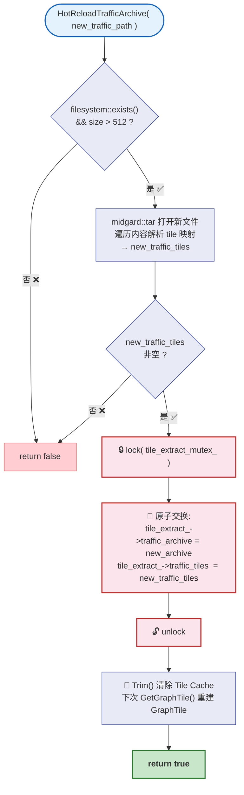

**线程安全分析**：
- `shared_ptr` 的赋值是原子操作（C++11 保证引用计数线程安全）
- `unordered_map` 的移动赋值需要 mutex 保护
- `Trim()` 不需要额外锁（cache 内部已有同步机制）
- 进行中的请求持有旧 `traffic_memory` 的 shared_ptr，旧 mmap 不会被释放

---

# 第十一章：完整调用链

## 11.1 写入链（Write Path）

```
valhalla_live_traffic --set-edge-speed "2/647736/0,370769,77,6"

main()                                      [valhalla_live_traffic.cc:402]
  ├→ cxxopts 解析命令行
  ├→ rapidjson 读取 valhalla.json
  └→ handle_set_edge_speed()               [valhalla_live_traffic.cc:354]
        ├→ 解析 "2/647736/0" → GraphId(647736, 2, 0).value
        ├→ 填充 EdgeSpeedMap[tile_id] = [(370769, 77.0, 6)]
        └→ update_edge_live_speeds()        [live_traffic_utils.cc:105]
              ├→ mmap(traffic.tar, PROT_READ|PROT_WRITE, MAP_SHARED)
              │    ┌─────────────────────────────────────────┐
              │    │ MMap RAII:                              │
              │    │   fd = open("traffic.tar", O_RDWR)     │
              │    │   data = mmap(fd, st_size, ...)        │
              │    │   length = st_size                     │
              │    └─────────────────────────────────────────┘
              │
              ├→ 设置 microtar 回调 (memcpy 操作 mmap 区域)
              ├→ while (mtar_read_header):
              │     ├→ GetTileId(tar_header.name) 获取 tile_id
              │     ├→ 匹配 speed_map 中的 tile
              │     ├→ TrafficTile(mmap_memory) 指向 mmap 区域
              │     │     header = mmap_data + tar.pos + 512
              │     │     speeds = header + 32
              │     ├→ const_cast 写入 header->last_update
              │     └→ *const_cast<TrafficSpeed*>(&speeds[370769])
              │           = encode_live_speed(77.0, 6)
              │           = TrafficSpeed{38, 38, 38, 38, 255, 255, 6, 6, 6, 0}
              │
              ├→ msync(data, length, MS_SYNC)    ← 强制刷盘
              └→ return 1
```

**写入链流程总结**：

```mermaid
flowchart LR
    CLI["valhalla_live_traffic<br/>--set-edge-speed"] --> PARSE["parse_edge_speeds_csv()<br/>tile_id → GraphId 编码"]
    PARSE --> UTILS["update_edge_live_speeds()"]
    UTILS --> MMAP["mmap( PROT_RW, MAP_SHARED )<br/>映射整个 traffic.tar"]
    MMAP --> LOOP["遍历 tar 条目<br/>匹配 tile_id"]
    LOOP --> WRITE["const_cast 写入<br/>TrafficSpeed (8 bytes)"]
    WRITE --> ENCODE["encode_live_speed()<br/>km/h → 位字段编码"]
    ENCODE --> SYNC["msync( MS_SYNC )<br/>强制刷入磁盘"]
    SYNC --> DONE["✅ 完成<br/>下次 GetSpeed() 自动获取新值"]

    classDef cli   fill:#e8eaf6,stroke:#3949ab,stroke-width:2px
    classDef lib   fill:#fff3e0,stroke:#e65100,stroke-width:2px
    classDef done  fill:#c8e6c9,stroke:#2e7d32,stroke-width:2px,font-weight:bold

    class CLI,PARSE cli
    class UTILS,MMAP,LOOP,WRITE,ENCODE,SYNC lib
    class DONE done
```

## 11.2 读取链（Read Path）

**Read Path 流程总览**：

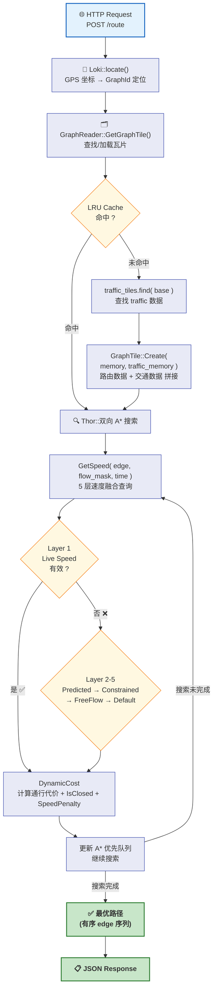

**详细调用追踪**：

```
POST /route {"locations":[...], "costing":"auto"}

Tyr::route_action
  ├→ Loki::locate()
  │     └→ GraphReader::GetGraphTile(graphid)          [graphreader.cc:551]
  │           ├→ cache_->Get(base) 检查 LRU 缓存
  │           ├→ tile_extract_->traffic_tiles.find(base)
  │           ├→ TarballGraphMemory(traffic_archive, pos)
  │           └→ GraphTile::Create(base, memory, traffic_memory)
  │                 └→ TrafficTile(traffic_memory)
  │                       ├→ header = reinterpret_cast<TrafficTileHeader*>(data)
  │                       └→ speeds = reinterpret_cast<TrafficSpeed*>(data + 32)
  │
  └→ Thor::双向 A* 搜索
        └→ for each candidate edge:
              ├→ GetSpeed(edge, flow_mask|kCurrentFlowMask, time, seconds_from_now)
              │                                      [graphtile.h:545]
              │   ├→ live_traffic_multiplier = 1 - min(seconds_from_now/3600, 1)
              │   ├→ if flow_mask & kCurrentFlowMask (0x08):
              │   ├→ if traffic_tile() 存在:
              │   ├→ traffic_tile.trafficspeed(edge_idx)
              │   │     └→ return *(speeds + edge_idx)  ← volatile 读取 mmap
              │   ├→ if speed_valid(): breakpoint1!=0 && overall!=127
              │   ├→ partial_live_speed = get_overall_speed() = overall << 1
              │   ├→ partial_live_pct = 1.0 (breakpoint1=255)
              │   ├→ partial_live_pct *= live_traffic_multiplier
              │   └→ if partial_live_pct == 1.0: return partial_live_speed
              │
              ├→ DynamicCost::IsClosed(edge, tile)
              │     └→ traffic_tile.trafficspeed(idx).closed()
              │           = breakpoint1!=0 && overall_speed==0
              │
              ├→ DynamicCost::SpeedPenalty(edge, tile, ...)
              │     └→ if flow_sources & kCurrentFlowMask:
              │           用 kConstrainedFlowMask 重算基线速度
              │           (排除 live speed 波动对惩罚因子的影响)
              │
              └→ 更新 A* 优先队列
```

## 11.3 /locate API 中的 live_speed 序列化

```
GET /locate?verbose=true {"locations":[{"lat":22.343,"lon":114.198}]}

loki::locate() → PathLocation
    │
    ▼
serialize_edges(location, reader, verbose=true)       [locate_serializer.cc:55]
    │
    └→ for each edge:
          ├→ tile->trafficspeed(directed_edge)        [graphtile.h:659]
          │     └→ 返回 const volatile TrafficSpeed&
          │
          ├→ traffic.json()                           [traffictile.h:140]
          │     └→ if speed_valid():
          │           "overall_speed": get_overall_speed()  (= 38*2 = 76)
          │           "speed_0": get_speed(0)
          │           "congestion_0": (congestion1-1)/62.0  (= 5/62 ≈ 0.08)
          │           "breakpoint_0": breakpoint1/255.0     (= 1.0)
          │
          └→ JSON 输出:
              {
                "edge_id": {"id": 370769, "level": 2, "tile_id": 647736},
                "live_speed": {
                  "overall_speed": 76,
                  "speed_0": 76,
                  "congestion_0": 0.08,
                  "breakpoint_0": 1.0
                }
              }
```

---

# 第十二章：数据流与时序分析

## 12.1 缓存层次

```
traffic.tar (磁盘)
    │ mmap (启动时一次)
    ▼
tile_extract_t (进程级, 只读 unordered_map)
    │ 缓存查找
    ▼
TileCache LRU (线程安全, 按需淘汰)
    │
    ▼
GraphTile (持有 traffic_memory, 零拷贝视图)
    │
    ▼
GetSpeed() → volatile TrafficSpeed& (单次内存读取)
```

## 12.2 查询命中路径

`GetSpeed()` 中 Live Speed 层的查询决策流程：

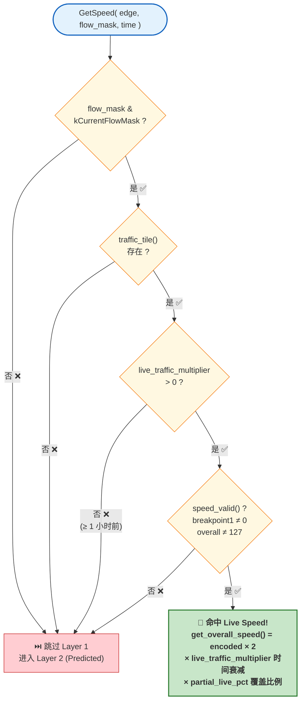

**未命中时的 Fallback 顺序**：Live → Predicted → Constrained → Freeflow → Default


## 12.3 两种更新方式

| | mmap 就地编辑（poc/） | 双缓冲热加载（realtime/） |
|------|------|------|
| **触发** | CLI 手动执行 | daemon 自动定期执行 |
| **延迟** | msync 后毫秒级 | 文件切换 + Trim 后生效 |
| **粒度** | 逐边修改 | 全量重建 |
| **适用场景** | 调试、手动注入、少量边更新 | 产线 7×24 自动化 |
| **是否需要重启** | 否 | 否 |

## 12.4 端到端系统全景图

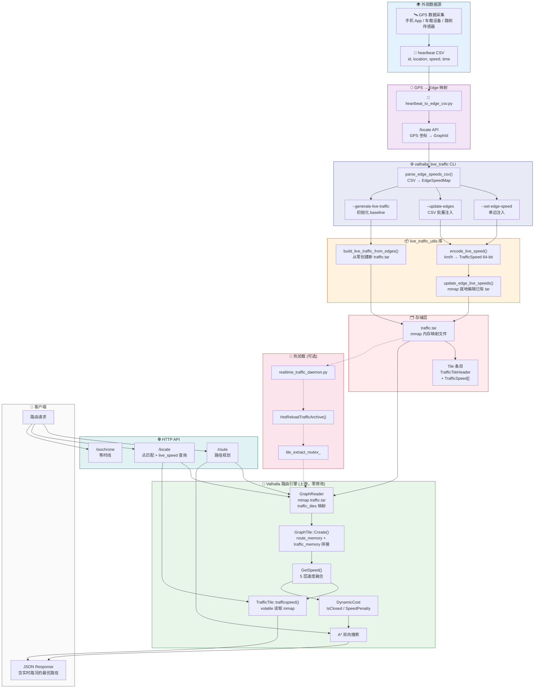

> 上图展示了从外部 GPS 数据到最终路由响应的完整数据链路。绿色区域（Valhalla 路由引擎）完全未修改，橙色区域（CLI + 库 + tar）是本项目的核心贡献。

## 12.5 数据失效机制

| 方式 | 条件 | 效果 |
|------|------|------|
| 时间衰减 | `seconds_from_now ≥ 3600` | `multiplier=0`，live speed 权重降为 0 |
| 缓存淘汰 | LRU 满或 `Trim()` | GraphTile 析构，下次重建 |
| 热加载替换 | `HotReloadTrafficArchive()` | 旧 traffic_memory 引用归零后释放 |
| 服务重启 | 进程退出 | 所有状态丢失，重新加载 |

## 12.6 完整请求时序图

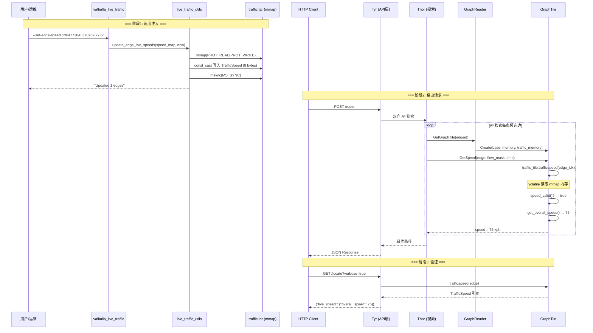

## 12.7 热加载时序图

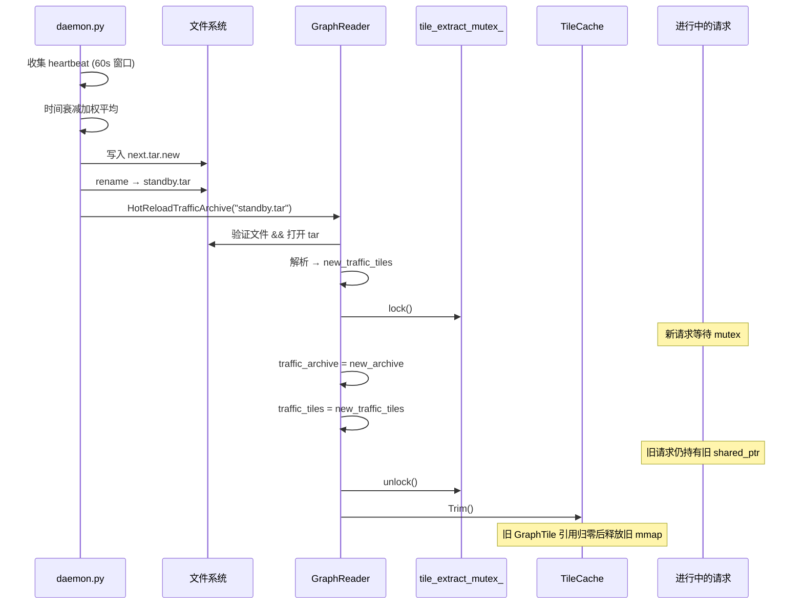

---

# 第十三章：设计思想与对比

## 13.1 四大设计原则

### 原则 1：不修改核心引擎

所有修改放在 `valhalla_code_overwrites/`，编译前复制。Valhalla 上游每月多次更新，不修改核心文件意味着零 merge 冲突。

### 原则 2：复用已有架构

Valhalla 的 `TrafficTile` / `traffic.tar` / `GetSpeed()` 架构已经过多年生产验证。本项目不新增数据结构、不新增文件格式、不新增 API 端点（除 Hot Reload）。

### 原则 3：mmap 就地编辑

- 零拷贝：不需要将整个 tar 文件读入用户空间再写回
- O(1) 定位：`speeds[edge_idx]` 直接数组索引
- 即时生效：volatile 读取 + mmap 共享内存

### 原则 4：in-place 编辑优先于 full rebuild

实际场景中每次只有 1-5% 的边速度变化。修改 100 条边 = 800 字节写入。重建整个 tar 需要写入所有边 = MB 级别 I/O。

## 13.2 备选方案对比

### 方案 A：修改 GraphTile 嵌入实时速度到 .gph

| 问题 | 说明 |
|------|------|
| 破坏二进制兼容性 | `.gph` 格式变更影响所有 Valhalla 用户 |
| 更新延迟大 | 每次更新需重写整个 `.gph`（MB 级 → 秒级） |
| 无法热加载 | 重写 `.gph` 需要独占锁 |

### 方案 B：应用层路由后过滤

| 问题 | 说明 |
|------|------|
| 不能影响 A* 搜索 | 只能过滤结果，不能引导搜索到更快的路 |
| 次优路径 | 拥堵路段可能被选中后再被过滤 |

### 方案 C：sidecar 进程通信（Unix Socket / Shared Memory）

| 问题 | 说明 |
|------|------|
| IPC 开销 | 每次查询需要跨进程通信（微秒级累积） |
| 序列化成本 | 需要额外的编码/解码 |
| 进程管理 | 额外的进程生命周期管理 |

## 13.3 性能特性

| 操作 | 复杂度 | 说明 |
|------|:---:|------|
| 写入一条边 | O(1) | mmap + 数组索引 + 8 字节赋值 |
| 读取一条边 | O(1) | volatile 指针解引用 + 位字段提取 |
| 查找 traffic tile | O(1) 平均 | unordered_map 按 tile_base 索引 |
| GetSpeed 决策 | O(1) | 4 个 if 条件（bit mask + nullptr 检查） |
| 热加载切换 | O(1) + 缓存重建 | mutex lock + shared_ptr 赋值 + Trim() |

**瓶颈不在实时速度层。**

---

# 第十四章：代码阅读指南

> 推荐按以下顺序阅读源码，每步约 30 分钟，总计约 3-4 小时。

## Step 1：理解数据格式（基础）

**阅读**：`valhalla/valhalla/baldr/traffictile.h`
- `TrafficSpeed` 位字段（第 53-66 行）
- `TrafficTileHeader` 结构（第 185-192 行）
- `TrafficTile` 类（第 230-275 行）

**自检**：`speed_valid()` 何时返回 true？`breakpoint1=255` 的含义？

## Step 2：理解消费端（Valhalla 怎么读）

**阅读**：
- `valhalla/valhalla/baldr/graphtile.h:545-657` — `GetSpeed()` 5 层融合
- `valhalla/src/baldr/graphreader.cc:44-164` — `tile_extract_t` 构造
- `valhalla/src/baldr/graphreader.cc:551-590` — `GetGraphTile()` 绑定 traffic_memory

**自检**：`GetSpeed()` 在什么条件下使用 live speed？`live_traffic_multiplier` 怎么衰减？

## Step 3：理解写入端（本项目核心）

**阅读**：
- `live_traffic_utils.h` — 接口定义
- `live_traffic_utils.cc:78-100` — `encode_live_speed()`
- `live_traffic_utils.cc:105-180` — `update_edge_live_speeds()`
- `live_traffic_utils.cc:186-277` — `build_live_traffic_from_edges()`

**自检**：为什么需要 `const_cast`？`build_live_traffic_from_edges()` 如何获取 edge_count？

## Step 4：理解 CLI 和构建

**阅读**：
- `valhalla_live_traffic.cc:279-333` — CSV 解析
- `valhalla_live_traffic.cc:337-400` — CLI handlers
- `valhalla_live_traffic.cc:402-498` — `main()`
- `build.sh` — 构建编排

**自检**：`parse_edge_speeds_csv()` 如何处理两种 tile_id 格式？

## Step 5：理解热加载（可选）

**阅读**：
- `realtime/src/baldr/graphreader_hot_reload.h` — 接口
- `realtime/src/baldr/graphreader_hot_reload.cc` — 实现

**自检**：为什么热加载后需要 `Trim()`？旧 mmap 何时释放？

## Step 6：端到端追踪

在脑中模拟一次完整的"注入 → 查询 → 路由"流程：

```
CLI --set-edge-speed
  → main() → handle_set_edge_speed()
  → update_edge_live_speeds()
  → encode_live_speed()
  → msync()

HTTP /locate?verbose=true
  → serialize_edges()
  → tile->trafficspeed()
  → traffic.json()
  → get_overall_speed()

HTTP /route
  → GetGraphTile() → GraphTile::Create(traffic_memory)
  → GetSpeed() → traffic_tile.trafficspeed(edge_idx)
  → speed_valid() + get_overall_speed()
  → DynamicCost → A* → 最优路径
```

---

# 第十五章：总结与展望

## 15.1 一句话总结

> **外部实时数据 → CSV → `valhalla_live_traffic` CLI → `encode_live_speed()` → mmap 就地编辑 `traffic.tar` → Valhalla `GetSpeed()` 通过 `volatile` 指针读取 → 5 层优先级的 Live Speed 层命中 → A* 搜索做出基于实时路况的最优路径决策。**

## 15.2 设计优点

| 优点 | 说明 |
|------|------|
| **零侵入** | 不修改 Valhalla 核心文件，所有修改集中在 overlay 目录 |
| **高性能** | mmap 直接访问，O(1) 读写，零拷贝，零序列化 |
| **即时生效** | mmap 就地编辑后，volatile 读取立即看到新值（毫秒级） |
| **线程安全** | volatile 原子读取 + shared_ptr 原子切换 + mutex 保护关键区 |
| **逐边精度** | 精确到单条边的速度控制，精度 2 kph |
| **产线友好** | CSV 批量接口，支持与任意上游数据管道对接 |
| **可验证** | `/locate` API 直接返回 live_speed，验证注入效果 |
| **易维护** | 全部自定义代码在 5 个文件中，接口清晰 |

## 15.3 不足与改进方向

| 不足 | 改进方向 |
|------|---------|
| `poc/` 模块缺少主动 Hot Reload 通知 | 集成 `realtime/` 模块的 `HotReloadTrafficArchive()` |
| `--generate-live-traffic` 一次只生成一个 tile | 支持多 tile 批量初始化 |
| CSV 注入不校验速度合理性 | 加入基于道路等级的速度范围校验 |
| mmap 就地编辑无历史记录 | 保留 update log 或 traffic.tar 版本管理 |
| `heartbeat_to_edge_csv.py` 逐点调 /locate，大量数据很慢 | 使用 Valhalla meili map-matching 库做离线批量匹配 |

## 15.4 未来可扩展方向

1. **多数据源融合**：支持手机 GPS、路侧传感器、浮动车等多源数据按置信度加权
2. **子段速度（Sub-segment Speed）**：利用 TrafficSpeed 的三分段能力，描述一条边内不同子段的速度差异
3. **事件关联**：利用 `has_incidents` 位关联交通事故、道路施工等信息
4. **速度预测**：基于当前实时速度 + 历史模式，生成短时预测速度
5. **自适应时间衰减**：根据道路等级、速度方差等因素动态调整衰减速率
6. **分布式 traffic.tar**：利用 Valhalla 已有的 `curl_tile_getter` 机制实现中心化实时速度分发

---

> **文档结束**
>
> 如果你按照[第十四章](#第十四章代码阅读指南)的推荐顺序阅读完所有源码，并理解了本文档的每一部分，你应该已经具备了独立使用、维护和扩展本项目的全部知识。
>
> 欢迎贡献 PR 和改进建议。
